NAMA    : NEVITA TRIYA YULIANA  
NIM     : 244107020208  
KELAS   : TI-2F
  

PRAKTIKUM WEEK 03:  
PRAKTIKUM 01:
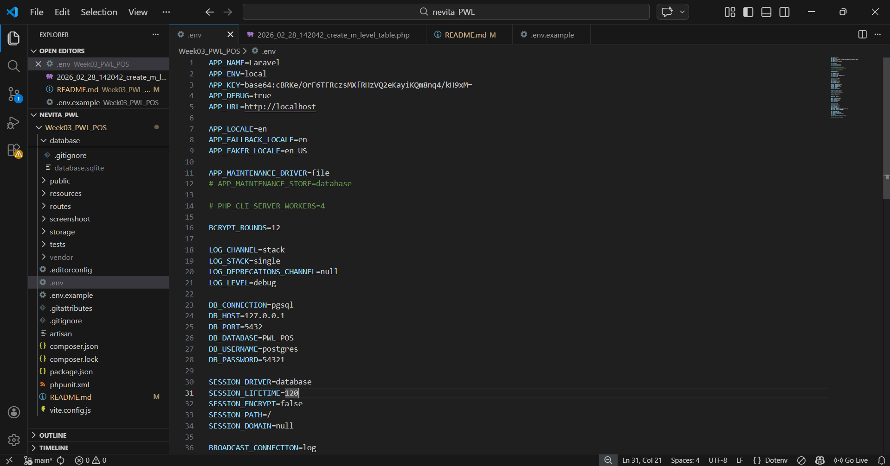  

PRAKTIKUM 02.1:
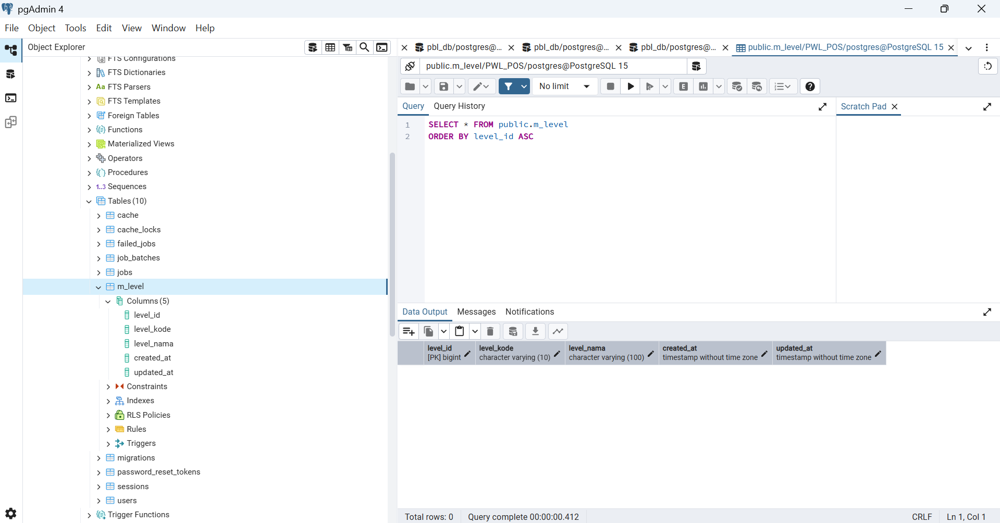
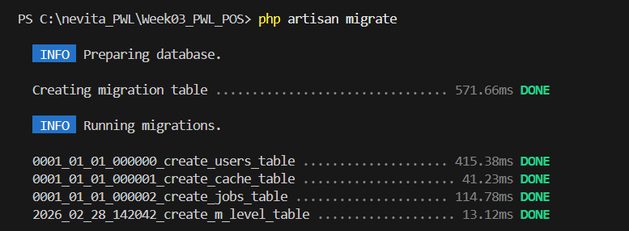
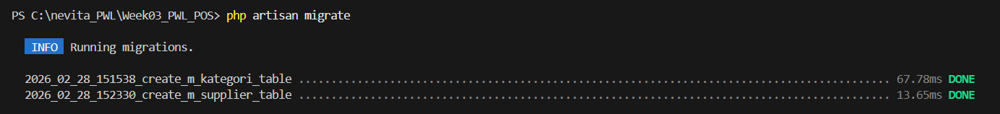  

PRAKTIKUM 02.2:

  

PRAKTIKUM 03:  
LevelSeeder:

UserSeeder:
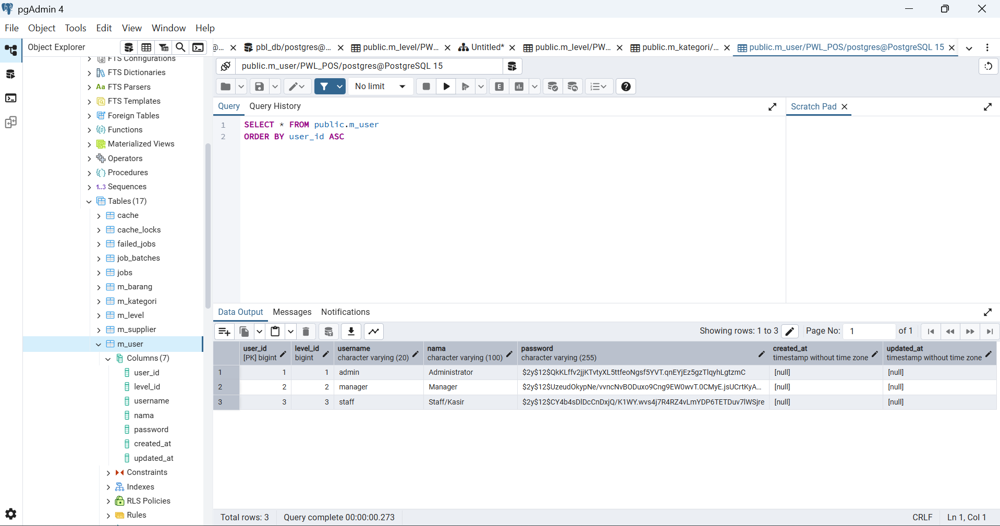
KategoriSeeder:
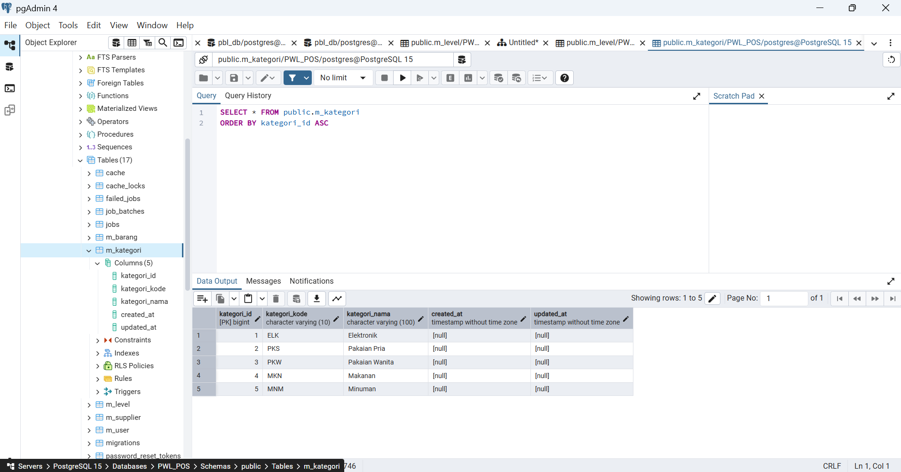
SupplierSeeder:
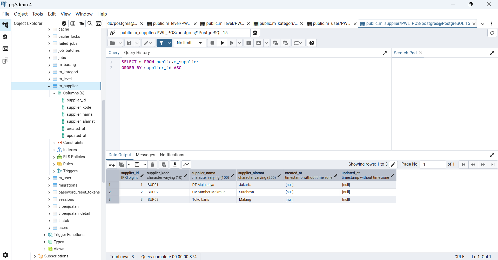
BarangSeeder:
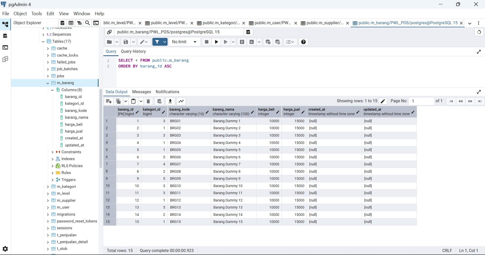
StokSeeder:
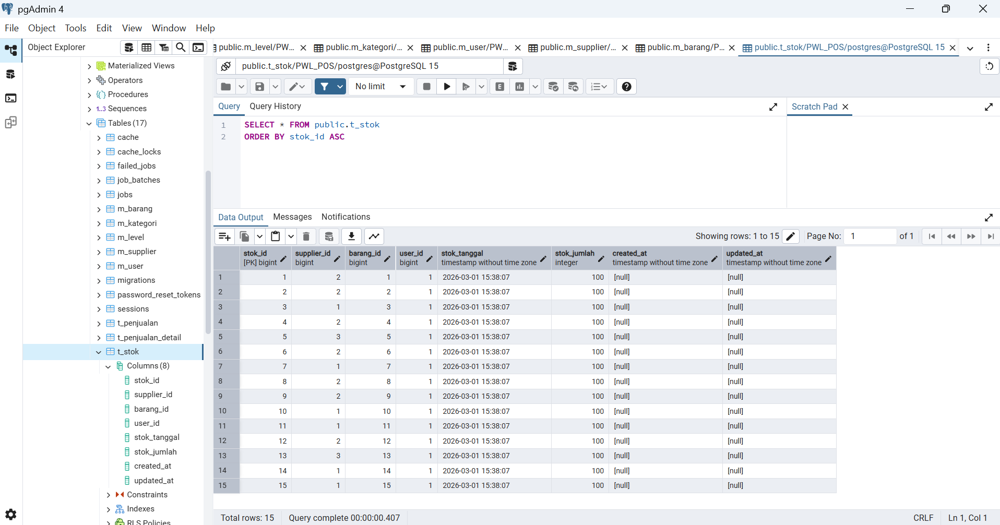
PenjualanSeeder:

PenjualanDetailSeeder:
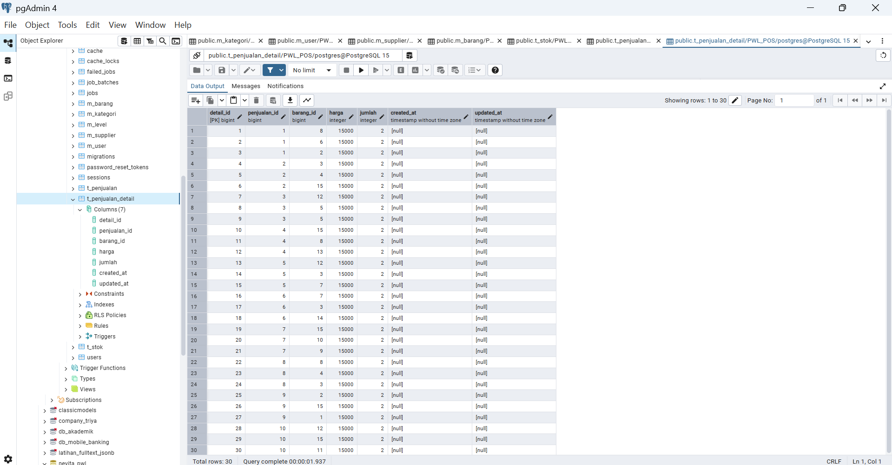  

PRAKTIKUM 04:  
Insert Data Baru Level:
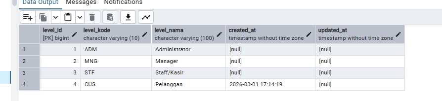  
Update Data Level:
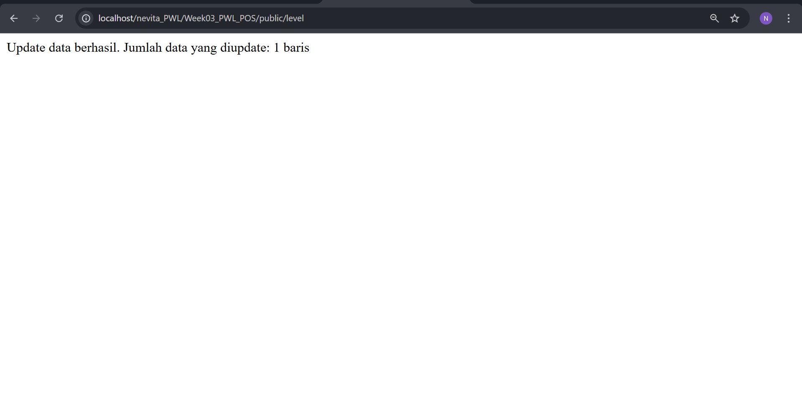
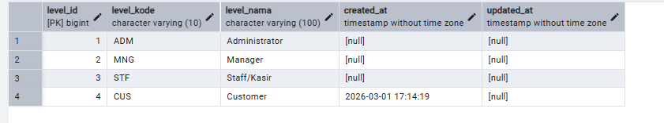  
Delete Data Level:
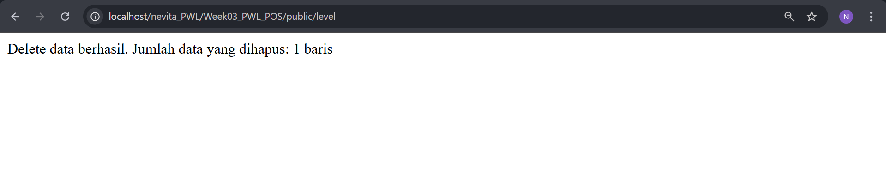
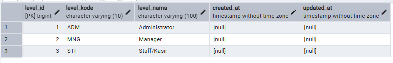  
Output:
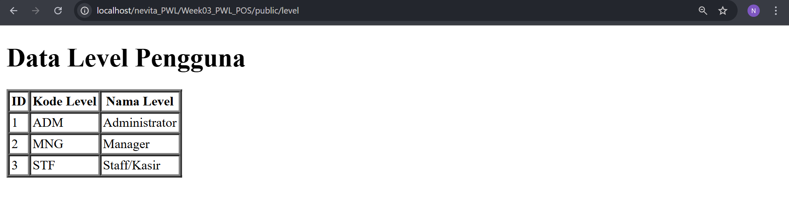  

PRAKTIKUM 05:  
Insert Data Kategori:
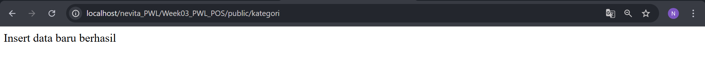
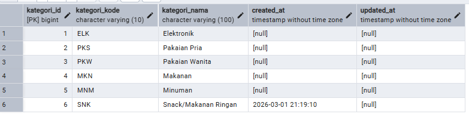  
Update Data Kategori:
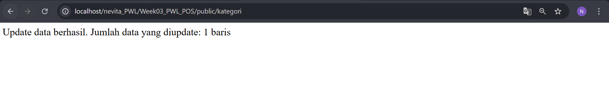
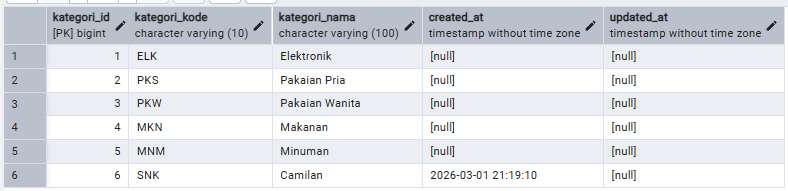  
Detele Data Kategori
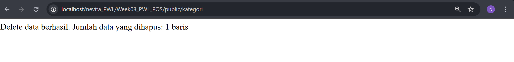
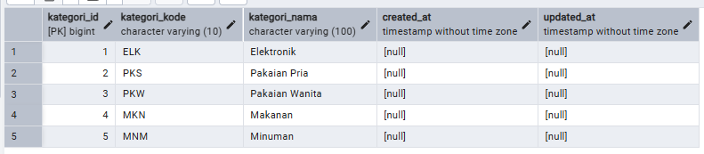  
Output:
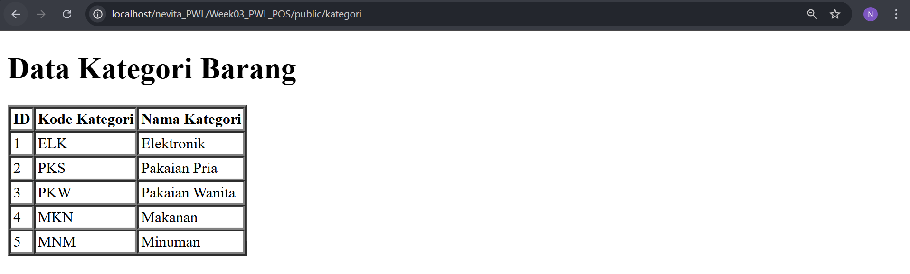

PRAKTIKUM 06:
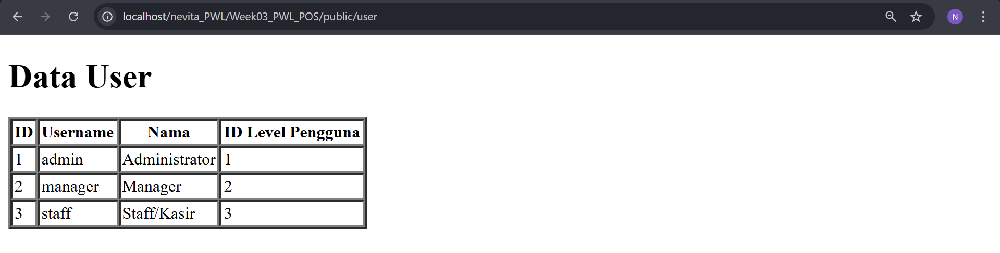
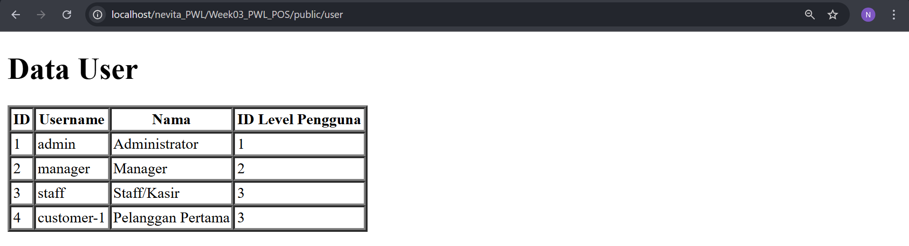

PENUTUP:  
1.Fungsi APP_KEY pada file .env Laravel: Berfungsi sebagai kunci rahasia (secret key) utama yang digunakan oleh Laravel untuk berbagai proses enkripsi dasar, seperti mengamankan session, enkripsi cookies, dan pembuatan token sandi.  

2.Cara generate nilai APP_KEY: Menggunakan perintah terminal php artisan 'key:generate'.  

3.Laravel secara default menyediakan file migrasi untuk: users (tabel pengguna), password_reset_tokens (token reset password), failed_jobs (menyimpan log kegagalan job/queue), dan personal_access_tokens (untuk autentikasi API/Sanctum).  

4.Tujuan '$table->timestamps();': Menghasilkan dua kolom otomatis di database, yaitu created_at (mencatat waktu data dibuat) dan updated_at (mencatat waktu data terakhir diubah) dengan tipe data timestamp / datetime.  

5.Tipe data dari '$table->id();': Menghasilkan tipe data BigInt Unsigned Auto Increment yang sekaligus dijadikan sebagai Primary Key pada tabel tersebut.  

6.Perbedaan '$table->id();' dengan '$table->id('level_id');:' yaitu '$table->id();' akan membuat kolom Primary Key dengan nama bawaan yaitu id. Sedangkan $table->id('level_id'); akan membuat kolom Primary Key dengan nama custom, yaitu level_id.  

7.Fungsi '->unique()': Memastikan (memberikan constraint unik) bahwa nilai data yang dimasukkan ke dalam kolom tersebut tidak boleh ada yang sama/duplikat dalam satu tabel tersebut.  

8.Perbedaan 'unsignedBigInteger' dan 'id()': 'id()' digunakan untuk membuat Primary Key yang nilainya otomatis bertambah (auto increment). Sedangkan 'unsignedBigInteger('level_id')' hanya membuat kolom bertipe BigInt tanpa sifat auto increment, yang tujuannya untuk disamakan tipe datanya dengan kolom Primary Key di tabel asal agar bisa dijadikan sebagai relasi / Foreign Key.  

9.Tujuan Class Hash: Digunakan untuk melakukan enkripsi password menggunakan algoritma Bcrypt agar tidak tersimpan sebagai teks biasa (plaintext) di database. Hash::make('1234') artinya mengenkripsi string '1234' menjadi hash yang aman.  

10.Kegunaan tanda tanya (?) pada DB Facade: Berfungsi sebagai parameter binding untuk mencegah celah keamanan SQL Injection. Nilai sebenarnya akan di-passing melalui array di parameter kedua.  

11.Tujuan penulisan 'protected $table & $primaryKey': Laravel Eloquent secara default akan mencari nama tabel berbentuk plural (misal: user_models) dan primary key bernama id. Karena kita menggunakan nama tabel kustom (m_user) dan PK kustom (user_id), kita wajib mendeklarasikan properti tersebut agar Model tahu tabel mana yang harus diakses.  

12.Cara yang lebih mudah (DB Facade / Query Builder / Eloquent ORM): Yang paling mudah dan efisien adalah Eloquent ORM. Karena memperlakukan tabel sebagai Objek (Object Oriented), kodenya menjadi jauh lebih rapi, tidak perlu menulis syntax SQL yang panjang secara manual, dan sangat memudahkan ketika harus berurusan dengan relasi antar tabel nantinya.  
   

PRAKTIKUM WEEK 04:  
PRAKTIKUM 01($fillable):
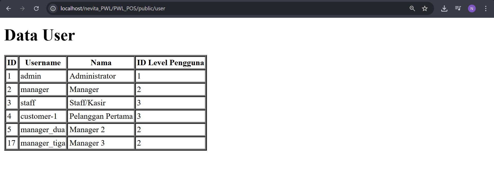  

PRAKTIKUM 02.1(Retrieving Single Models):  
(find(1)):
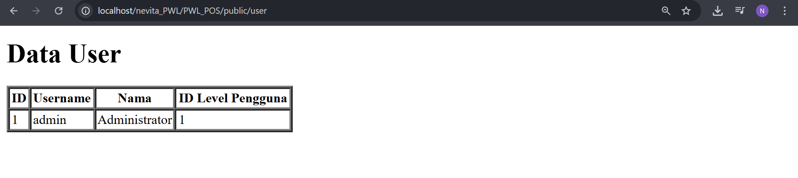
(findOr(1)):
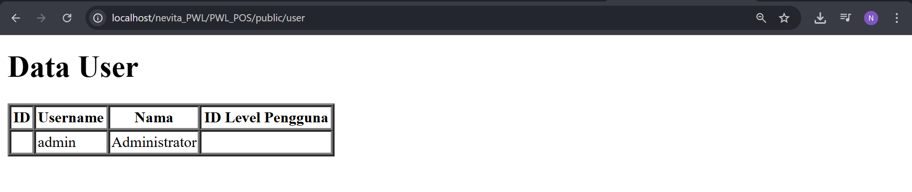
(findOr(20)):
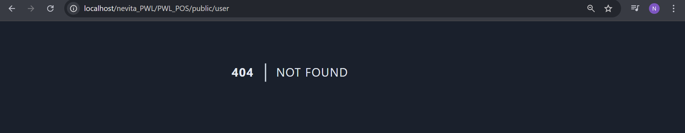  

PRAKTIKUM 02.2(Not Found Exceptions):  
findOrFail(1):
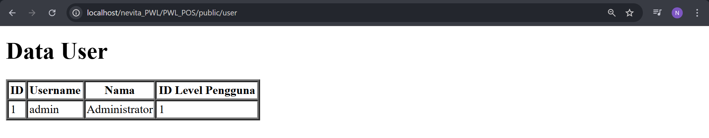
findOrfail(manager9):
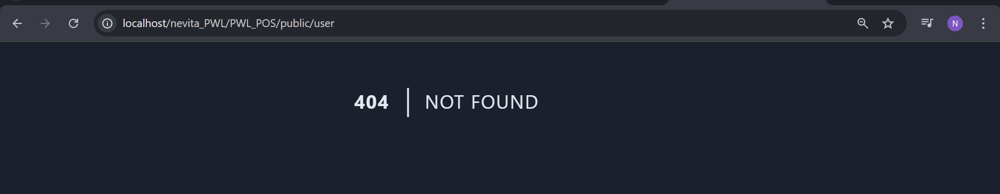  

PRAKTIKUM 02.03(Retreiving Aggregrates): 
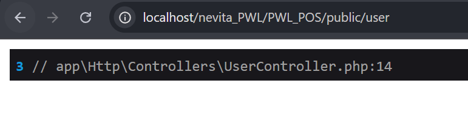  
Menampilkan jumlah pengguna dengan id 2:
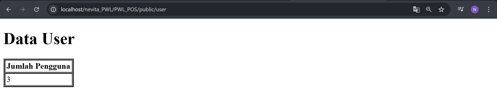  

PRAKTIKUM 02.4(Retreiving or Creating Models):  
firstOrCreate Manager:
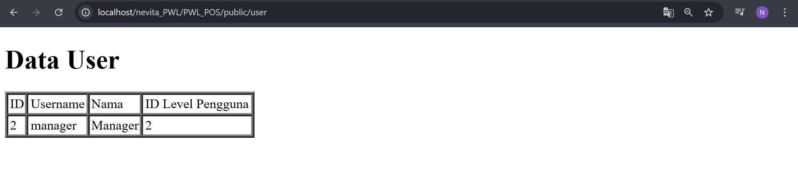
firstOrCreate Manager22:
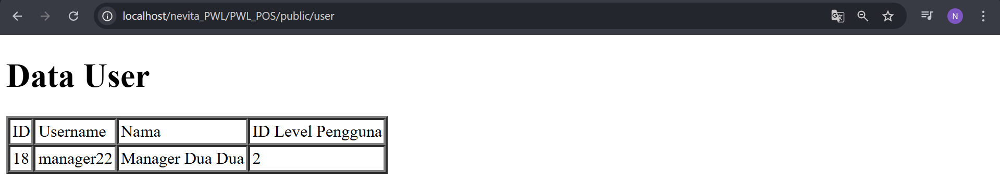
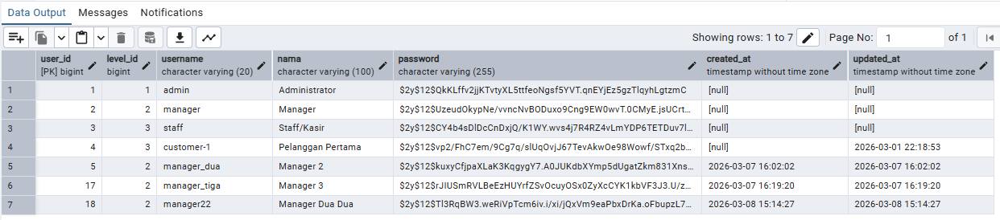  
firstOrNew Manager:
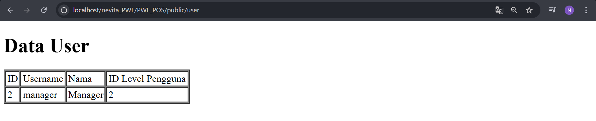
firstOrNew Manager33:
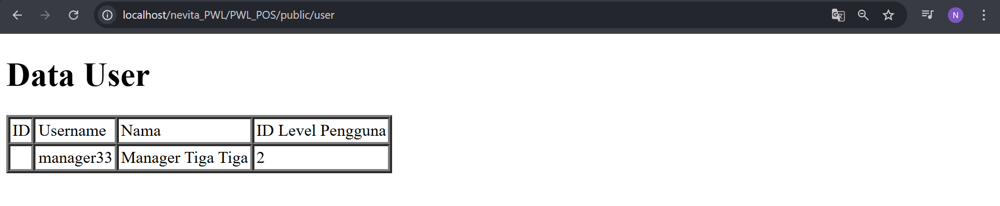
(Karena data manager33 masih berupa draf dan belum resmi dimasukkan ke dalam tabel PostgreSQL, maka database belum sempat membuatkan dan memberikan nomor urut ID untuknya)  
Menambahkan $user->save();:
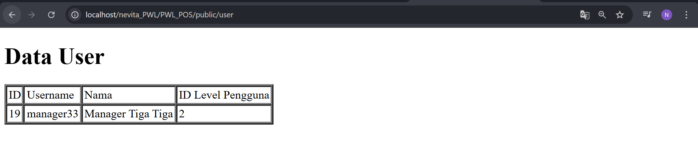 
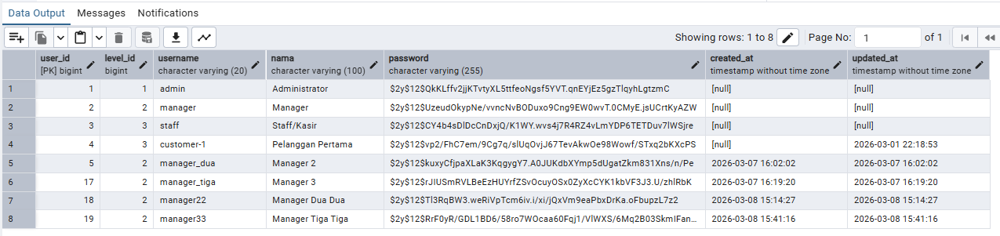  

PRAKTIKUM 02.5(Attribute Changes):  
isDirty():
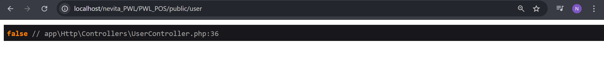
wasChanged:
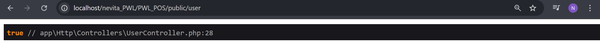  

PRAKTIKUM 02.6(Create, Read, Update, Delete (CRUD)):
Langkah 1&2:
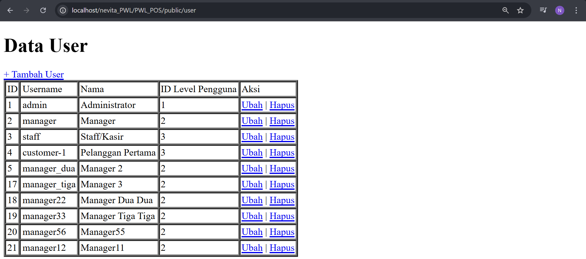
Langkah 4s/d6:
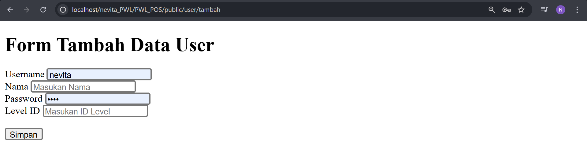
Menambahkan Data User:
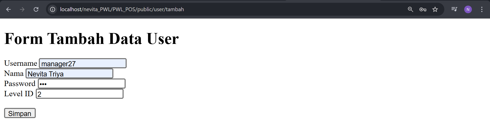

Menjalankan link 'ubah':
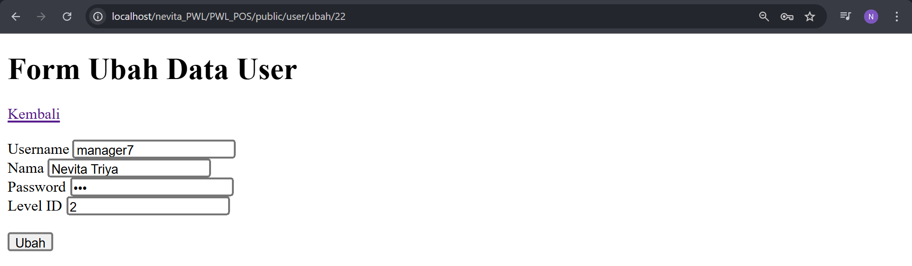
Mengubah Data user:
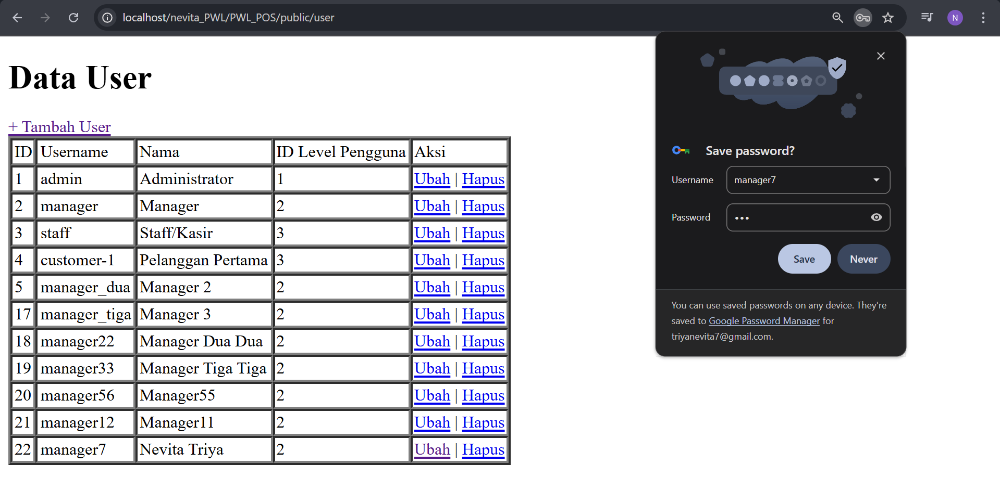
Menghapus Data user:
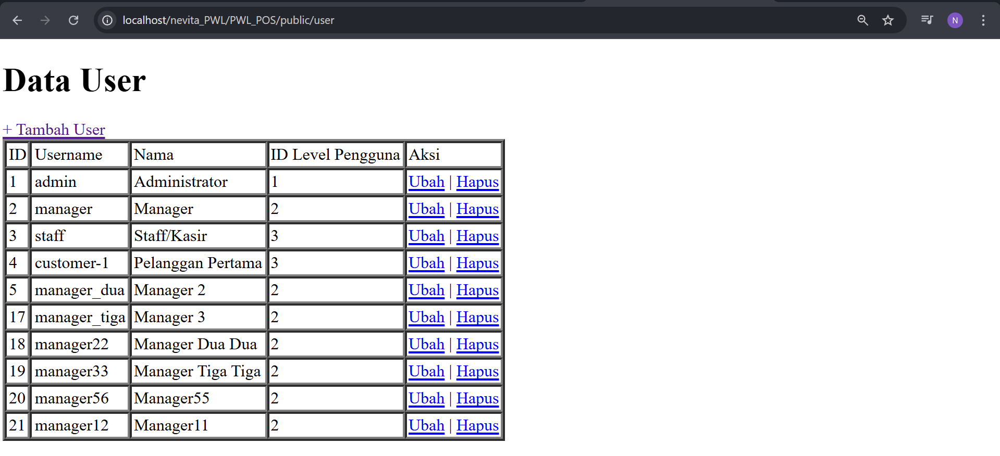  

