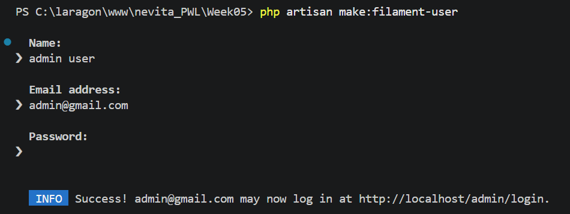
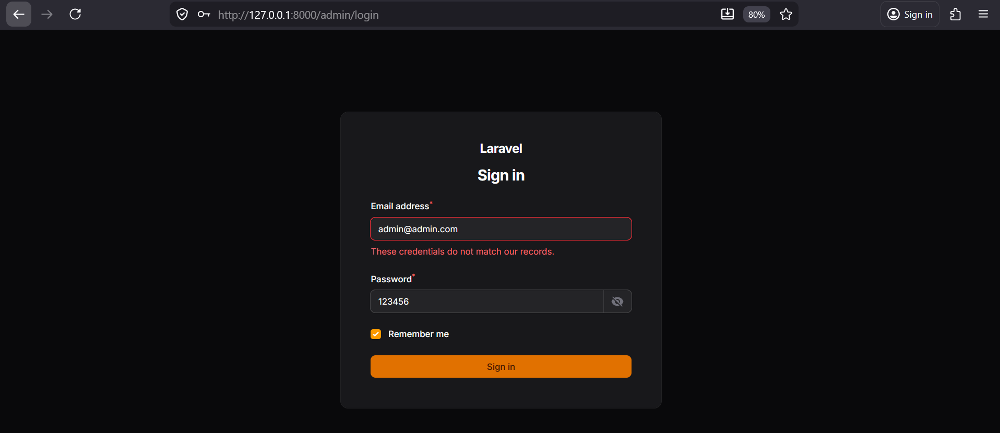

NAMA  : NEVITA TRIYA YULIANA  
KELAS : TI-2F  
ABSEN : 20  

## LAPORAN PRAKTIKUM WEEK05

## JOBSHEET 01 
## Langkah Praktikum :
## Langkah 1 – Membuat Project Laravel Baru 
Install Laravel dengan nama project Week05  
## Langkah 2 – Konfigurasi Database MySQL 
1.Edit file .env

2.Jalankan migrasi
  
## Langkah 3 – Install Filament v4 
1.Install Filament

2.Install Panel Builder

  
## Langkah 4 – Membuat User Admin 

## Langkah 5 – Menjalankan Aplikasi 

Database:
 
## Analisis & Diskusi :
1.Kelebihan Filament: Memungkinkan pembuatan admin panel dengan cepat dan elegan tanpa banyak coding manual, karena menyediakan banyak komponen UI dan fitur bawaan.  
2.Filament dibangun menggunakan Livewire untuk memberikan interaktivitas dinamis pada halaman web tanpa perlu menulis banyak kode JavaScript khusus atau melakukan reload halaman penuh.  
3.SQLite adalah database berbasis file yang sangat ringan dan mudah disetup (cocok untuk testing cepat). Sedangkan MySQL atau PostgreSQL (yang digunakan pada project ini di pgAdmin) adalah sistem manajemen database (RDBMS) berbasis server yang kuat, memiliki integritas data yang lebih ketat, dan merepresentasikan environment yang sama dengan versi production sesungguhnya.  
4.Fungsi Panel Builder: Digunakan untuk membuat, mengonfigurasi, dan mengelola antarmuka admin (panel). Fitur ini juga memfasilitasi pembuatan sistem dengan multi-panel.  

