## NAMA  : NEVITA TRIYA YULIANA  
## KELAS : TI-2F  
## ABSEN : 20  

## LAPORAN PRAKTIKUM WEEK07

<h3>JOBSHEET 01</h3>

 
<blockquote>

## Struktur Database Product
**Database**
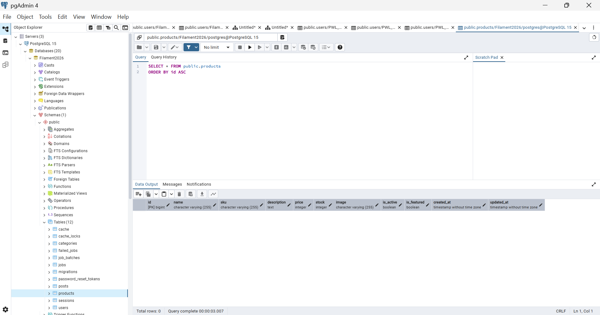
## Membuat Resource Product
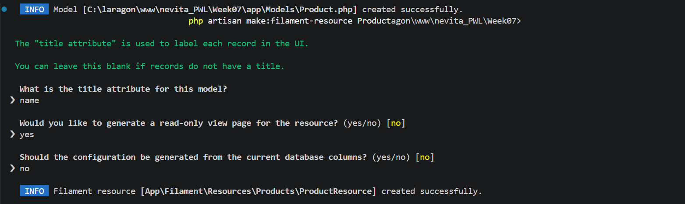
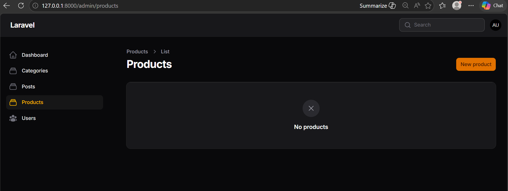
## Implementasi Wizard Form
**Step 1 – Product Info**
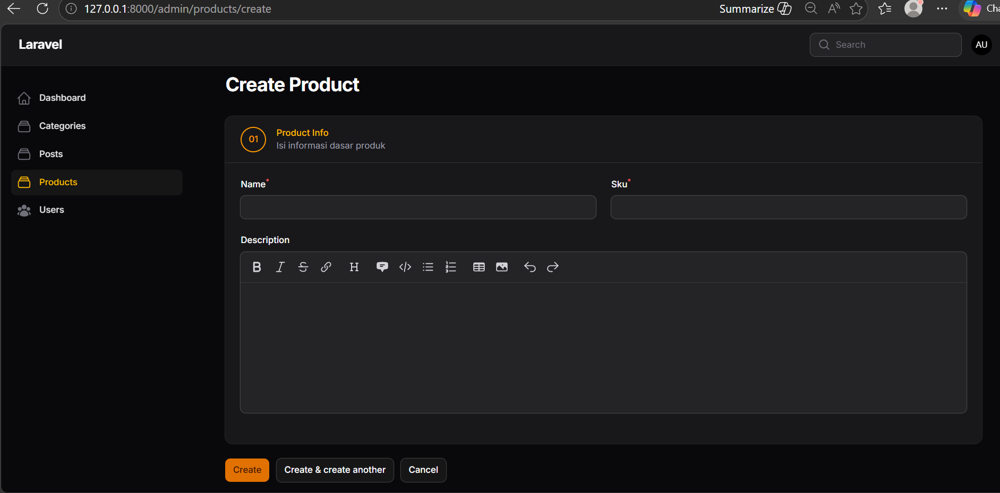
**Step 2 – Pricing & Stock**
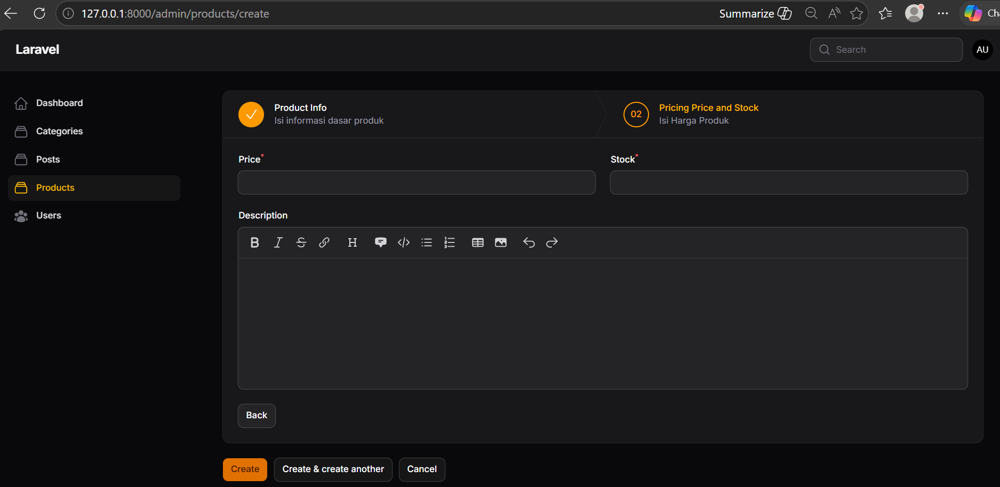
**Step 3 – Media & Status**
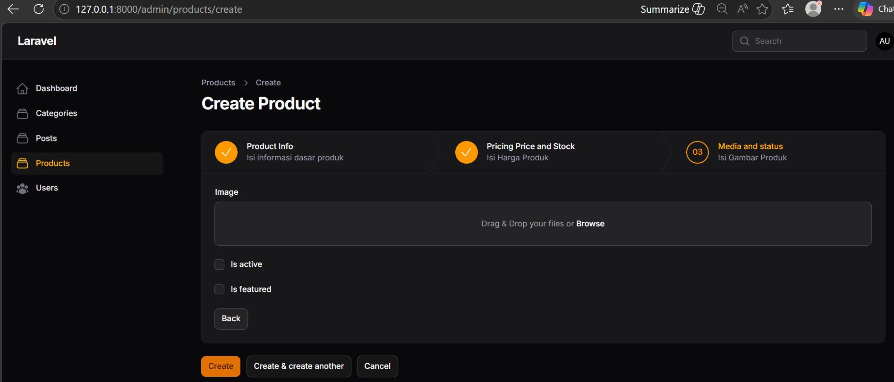
## Menambahkan Tombol Submit
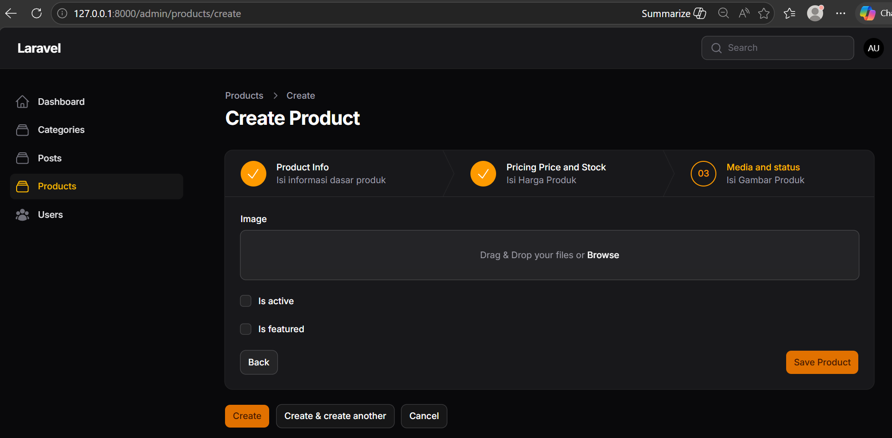
## Menghilangkan Default Button
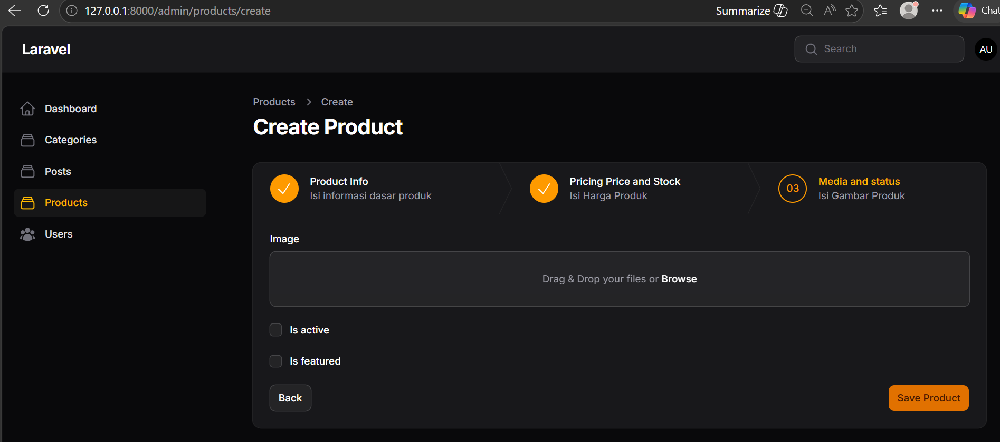
## Menampilkan Data pada Table
**Tampilan Web**
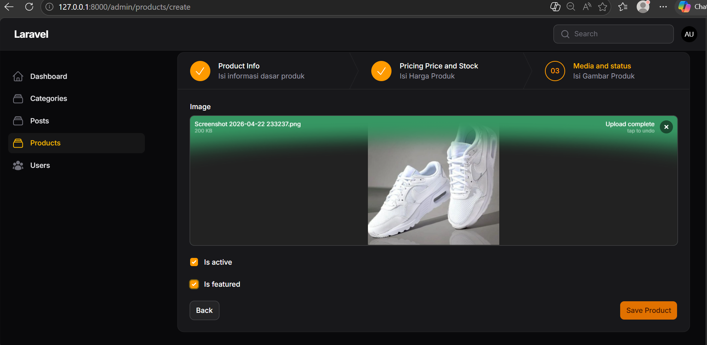
**Database**
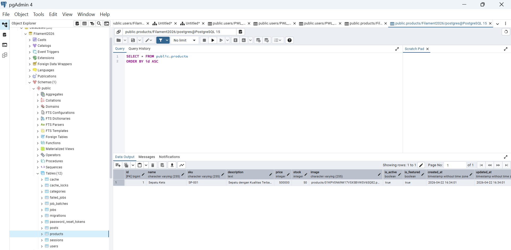
**Halaman Awal**
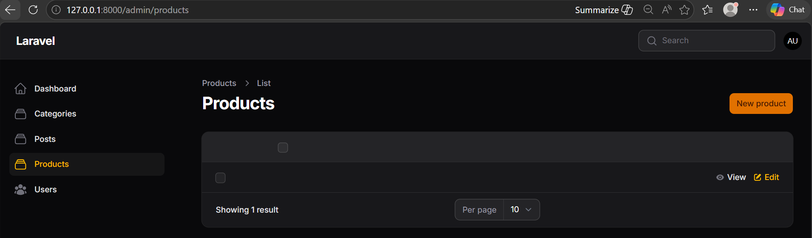
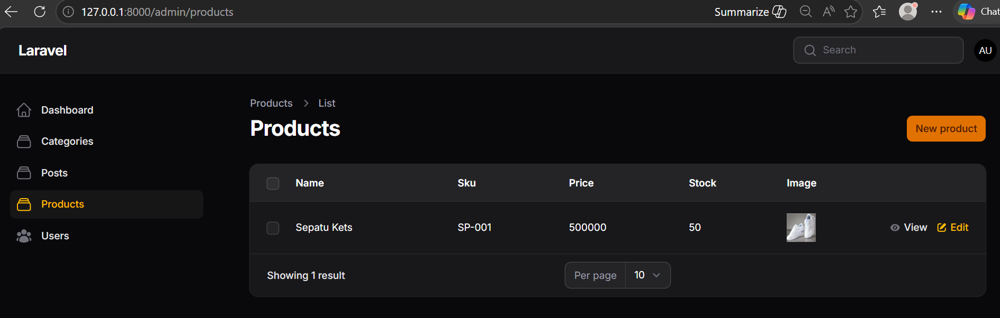

## Analisis & Diskusi
**1. Mengapa Wizard Form lebih baik untuk form panjang?**  
Wizard Form lebih baik karena menerapkan prinsip chunking (memecah informasi menjadi bagian-bagian kecil). Saat berhadapan dengan form yang sangat panjang (seperti data produk e-commerce yang kompleks), pengguna sering kali merasa kewalahan (overwhelmed). Dengan Wizard Form, tampilan menjadi lebih terstruktur, fokus pengguna terjaga, dan proses pengisian data terasa lebih ringan dan sistematis.  
**2. Kapan kita menggunakan skippable()?**  
Fitur ->skippable() digunakan ketika ada sebuah langkah (step) di dalam form yang isiannya bersifat opsional atau tidak wajib diisi pada saat itu juga . Dengan fitur ini, pengguna diizinkan untuk menekan tombol "Next" dan melompati langkah tersebut tanpa terhalang oleh sistem validasi (error wajib isi). 
**3. Apa kelebihan multi step dibanding single form panjang?**  
-> Fokus Kontekstual: Pengguna hanya dihadapkan pada isian yang saling berkaitan pada satu waktu (misalnya fokus pada "Informasi Produk" dulu, baru lanjut ke "Harga & Stok").  
->Validasi Bertahap: Kesalahan input (error validasi) dapat langsung dideteksi dan diperbaiki di tiap langkahnya . Pada form tunggal yang panjang, pengguna sering kali harus men-scroll jauh ke atas/bawah hanya untuk mencari di mana letak kolom yang salah. 
->Tampilan Lebih Rapi: Menghemat ruang vertikal pada layar sehingga User Interface (UI) terlihat jauh lebih profesional dan bersih. 
**4. Apakah wizard cocok untuk semua jenis form?** 
Tidak. Wizard Form sangat cocok dan direkomendasikan untuk form yang panjang, berjenjang, dan kompleks. Namun, untuk form yang sederhana dan hanya membutuhkan sedikit kolom (misalnya form input Kategori yang hanya berisi nama dan deskripsi singkat), penggunaan wizard justru akan memperburuk User Experience (UX) karena memaksa pengguna melakukan ekstra klik ("Next") yang sebenarnya tidak perlu.
</blockquote>

 

<h3>JOBSHEET 02</h3>

 
<blockquote>

## Membuat Section – Product Info
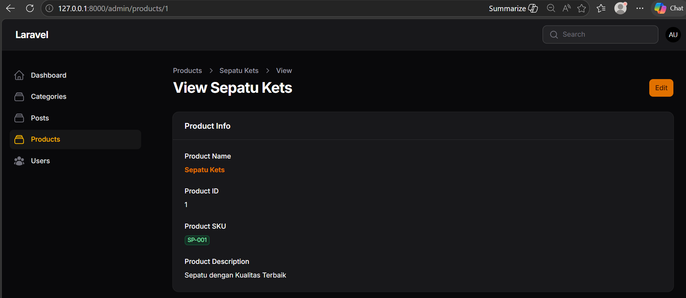
## Section – Pricing & Stock
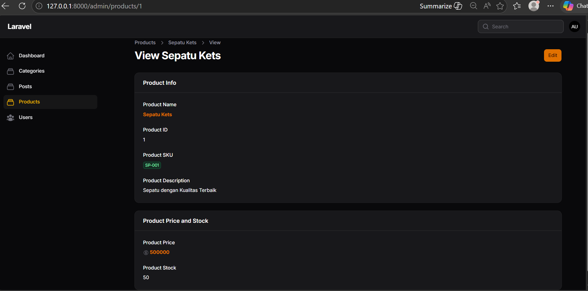
## Section – Media & Status
**Menampilkan Gambar**
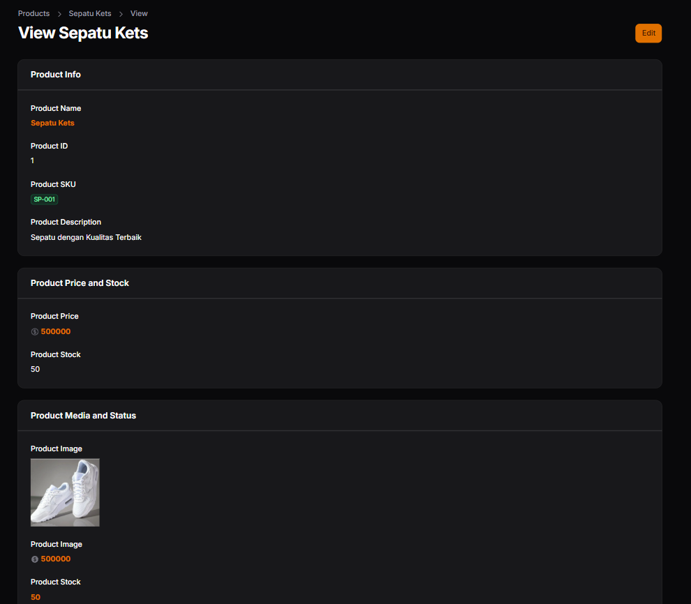 
**Menampilkan Status Boolean**
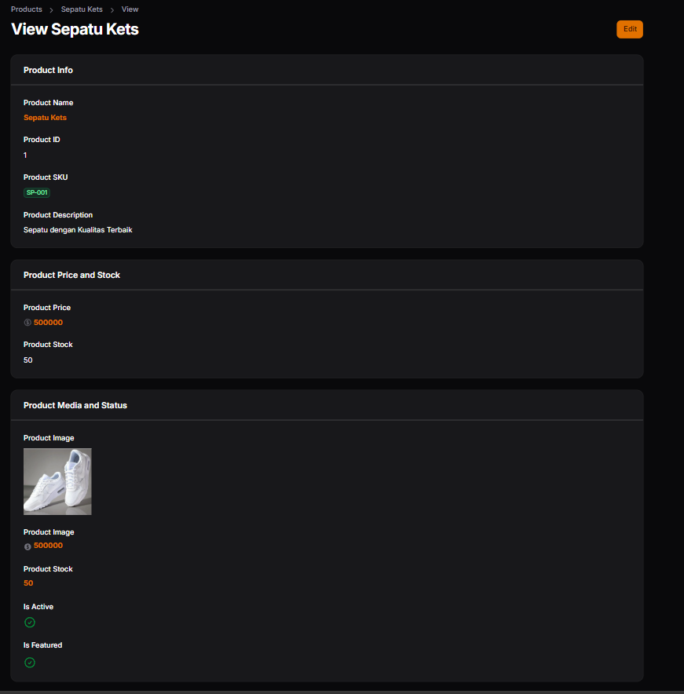 
**Menampilkan Tanggal dengan Format**
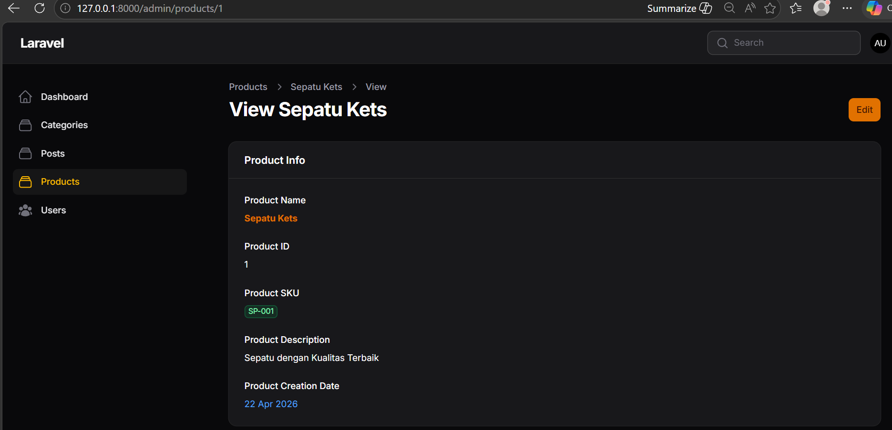

## Analisis & Diskusi
**1. Mengapa View Page tidak cocok menggunakan form input?**  
View Page dirancang secara khusus sebagai halaman untuk membaca informasi (read-only display), bukan untuk memasukkan atau mengedit data. Jika kita menggunakan komponen form input yang sekadar dimatikan (disabled), tampilannya menjadi kurang informatif, kaku, dan berpotensi membingungkan pengguna karena menyerupai halaman Edit . Sebaliknya, penggunaan Info List membuat tampilan data menjadi jauh lebih rapi, terstruktur, dan terlihat profesional.  
**2. Apa perbedaan TextColumn dan TextEntry?**  
-> TextColumn: Digunakan di dalam komponen Tabel (pada halaman List) untuk menampilkan data dalam bentuk kolom dan baris yang sejajar. Sedangkan  
-> TextEntry: Digunakan di dalam komponen Info List (pada halaman View Detail) untuk menampilkan teks informasi yang berdiri sendiri atau berada di dalam sebuah Section.  
**3. Kapan kita menggunakan badge?**  
Kita menggunakan fitur badge() ketika ingin menampilkan suatu data dalam bentuk label tersendiri agar lebih menonjol. Penggunaan ini sangat cocok diterapkan pada data yang bersifat penting, unik, atau berupa kategori singkat agar cepat dikenali oleh mata, seperti menampilkan kode identitas unik (SKU), status pengguna, atau label produk.  
**4. Apa keuntungan menggunakan IconEntry untuk boolean?**  
Keuntungan utama menggunakan IconEntry adalah kemampuannya menerjemahkan nilai logika dasar (True/False atau 1/0) menjadi indikator visual yang sangat intuitif. Jika nilainya true maka akan muncul ikon centang (✔), dan jika false akan muncul ikon silang (✖) . Secara psikologis, melihat ikon visual membuat pengguna jauh lebih cepat menangkap informasi status (seperti is_active atau is_featured) dibandingkan harus membaca teks "Ya/Tidak".
</blockquote>

 
