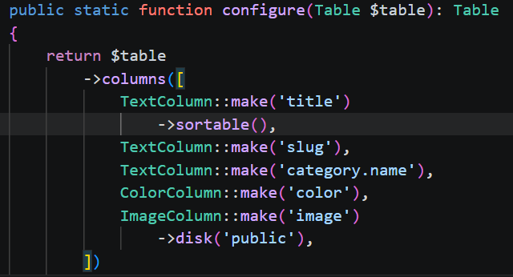
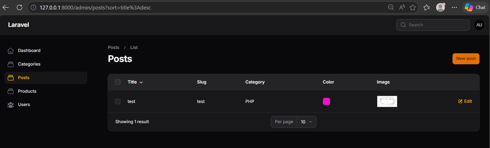
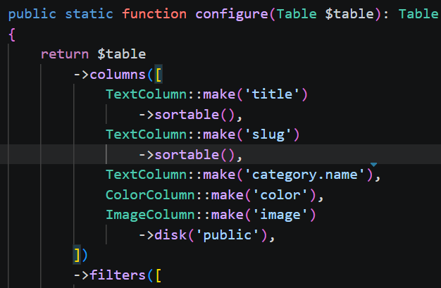
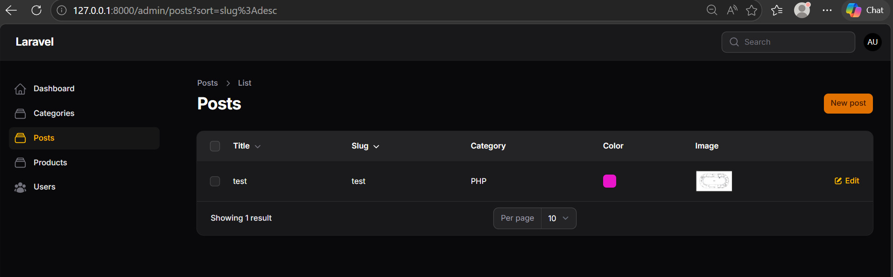
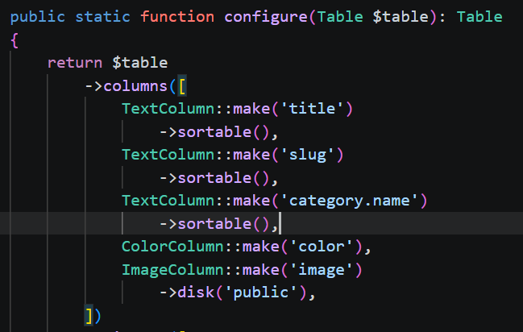
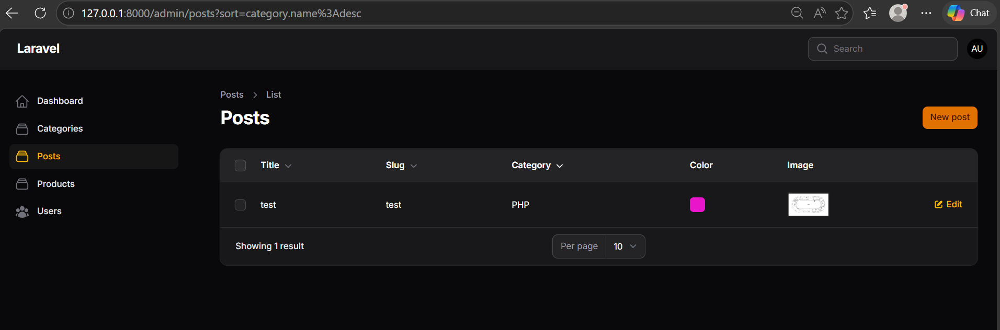
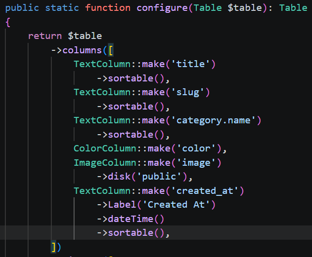
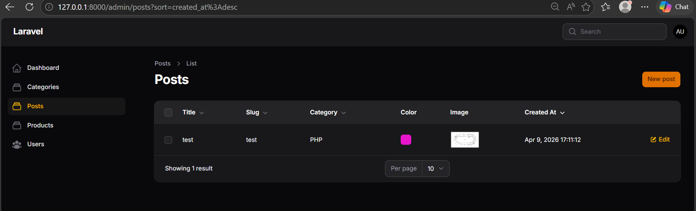
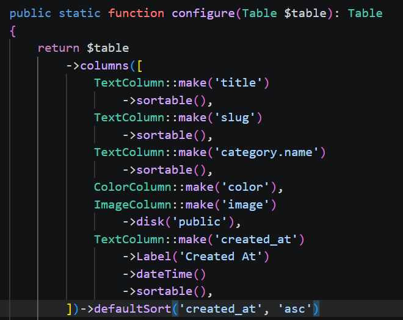
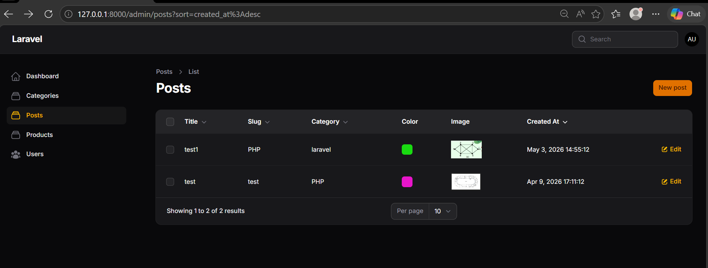

## NAMA  : NEVITA TRIYA YULIANA  
## KELAS : TI-2F  
## ABSEN : 20  

## LAPORAN PRAKTIKUM WEEK10

<h3>Implementasi Sorting pada Kolom Title</h3>

 
<blockquote>

## Code
 
## Output

</blockquote>

 

<h3>Sorting pada Kolom Slug</h3>

 
<blockquote>

## Code
 
## Output

</blockquote>

 

<h3>Sorting pada Relasi (Category)</h3>

 
<blockquote>

## Code
 
## Output

</blockquote>

 

<h3>Sorting pada Kolom Tanggal</h3>

 
<blockquote>

## Code
 
## Output

</blockquote>

 

<h3>Mengatur Default Sorting</h3>

 
<blockquote>

## Code
 
## Output

</blockquote>

 

<h3>Analisis & Diskusi</h3>

 
<blockquote>
 
**1. Mengapa sorting penting pada admin panel?**  
Sorting sangat penting karena ketika data bertambah banyak, pengguna akan sangat membutuhkan fitur untuk mengurutkan data (misalnya dari A-Z atau berdasarkan tanggal terbaru). Selain itu, sorting sangat penting untuk memudahkan manajemen data dalam skala yang besar. 
**2. Apa perbedaan sortable biasa dengan defaultSort()?** 
-> Method sortable() berfungsi untuk mengaktifkan fitur sorting pada kolom tertentu. Ini memungkinkan pengguna untuk mengurutkan tabel secara manual dengan mengklik header kolom. 
-> Method defaultSort() berfungsi untuk mengatur sorting bawaan (default) pada tabel. Ini membuat tabel otomatis terurut berdasarkan kolom dan kriteria tertentu sejak pertama kali halaman dimuat. 
**3. Mengapa relasi tetap bisa di-sort?** 
Kolom yang berasal dari relasi (seperti category.name) tetap bisa diurutkan karena sistem Filament secara otomatis menangani proses join relasi di dalam database. 
**4. Kapan kita menggunakan desc sebagai default?** 
Opsi desc (urut turun atau Z-A/9-0) sangat tepat digunakan sebagai default ketika kita ingin data terbaru tampil paling atas. Contoh penggunaannya adalah pada kolom tanggal pembaruan atau pembuatan, seperti ->defaultSort('created_at', 'desc').
</blockquote>

