## NAMA  : NEVITA TRIYA YULIANA  
## KELAS : TI-2F  
## ABSEN : 20  

## LAPORAN PRAKTIKUM WEEK11
## LANGKAH - LANGKAH PRAKTIKUM

<h3>A. Menambahkan Search pada Kolom</h3>

 
<blockquote>

## 1. Search pada Title 
**Code** 
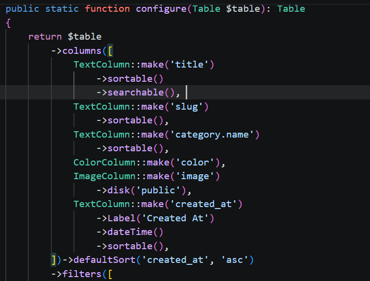 
**Output**
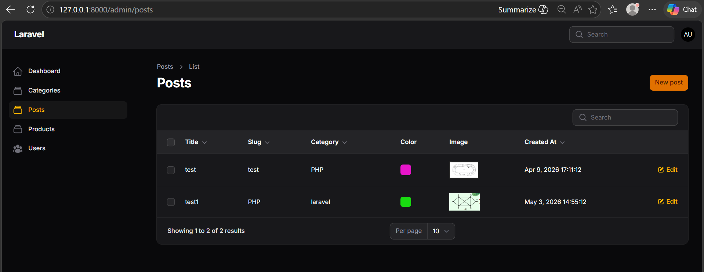
## 2. Search pada Slug
**Code** 
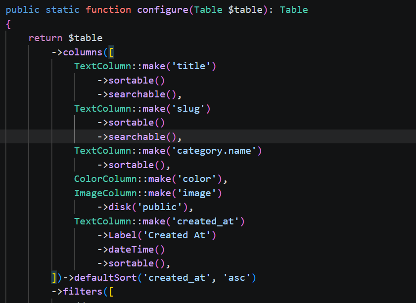  
**Output**
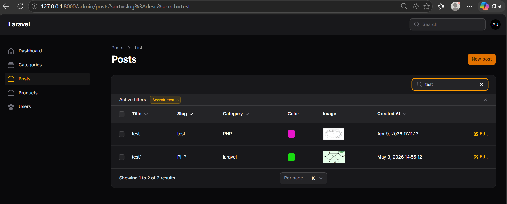
## 3. Search pada Relasi Category
**Code** 
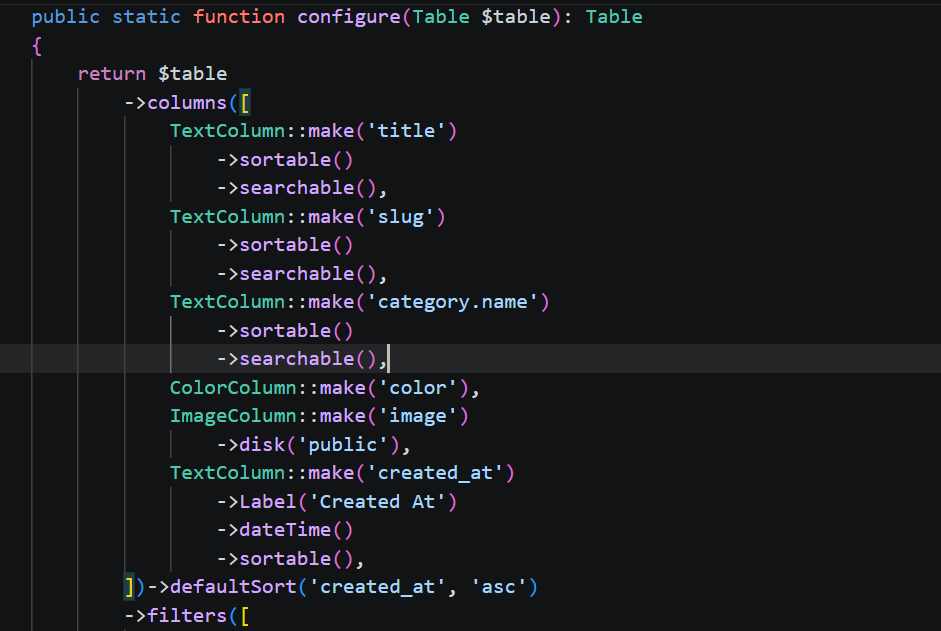 
**Output**
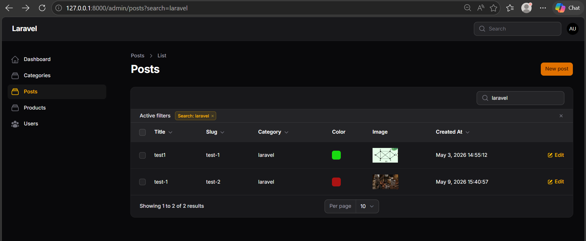
</blockquote>

 

<h3>B. Membuat Filter Berdasarkan Tanggal</h3>

 
<blockquote>

## 1. Tambahkan Filter Created At
**Code** 
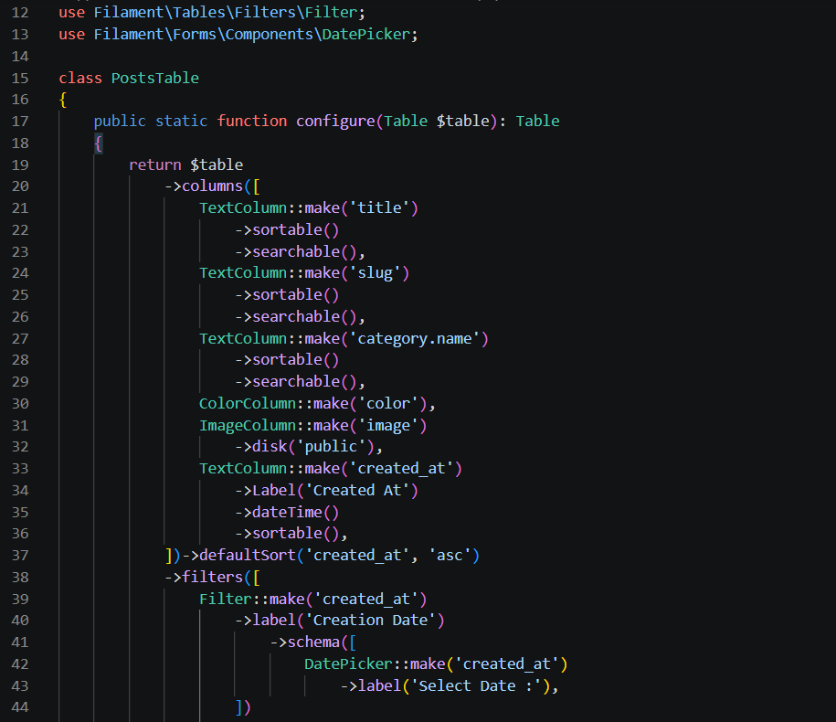 
**Output**
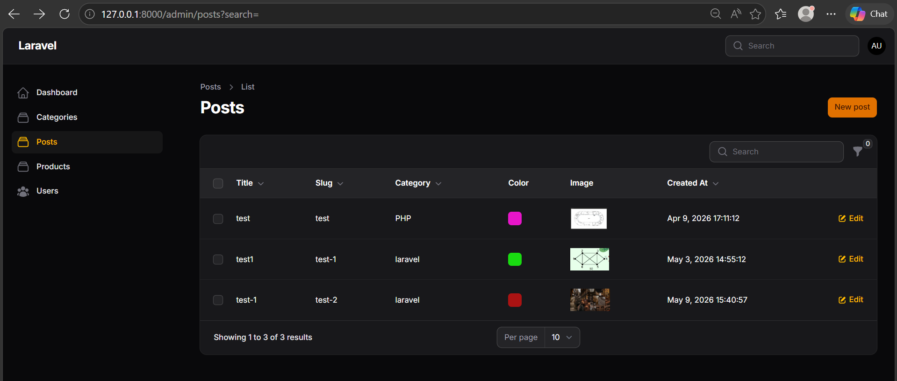
## 2. Menambahkan Query Logic
**Code** 
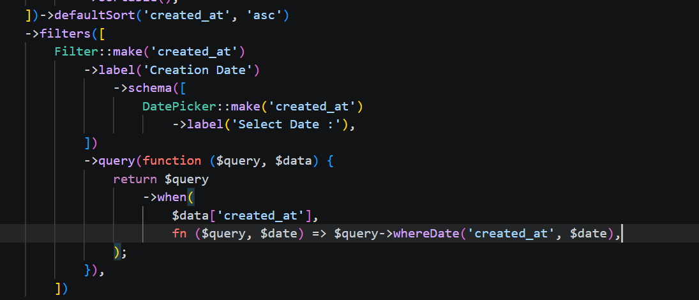 
**Output**
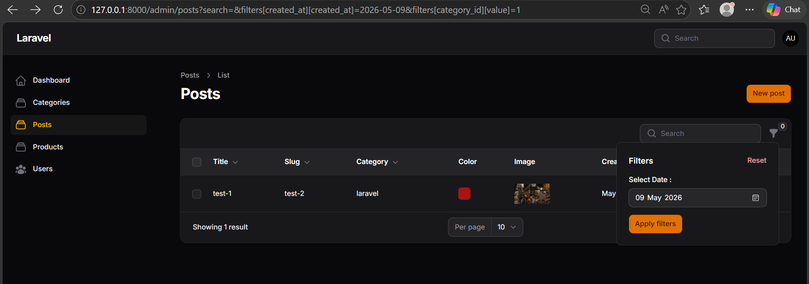
</blockquote>

 

<h3>C. Membuat Filter Berdasarkan Relasi (Kategori)</h3>

 
<blockquote>

## Code
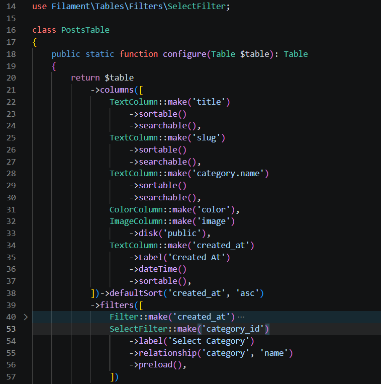 
## Output
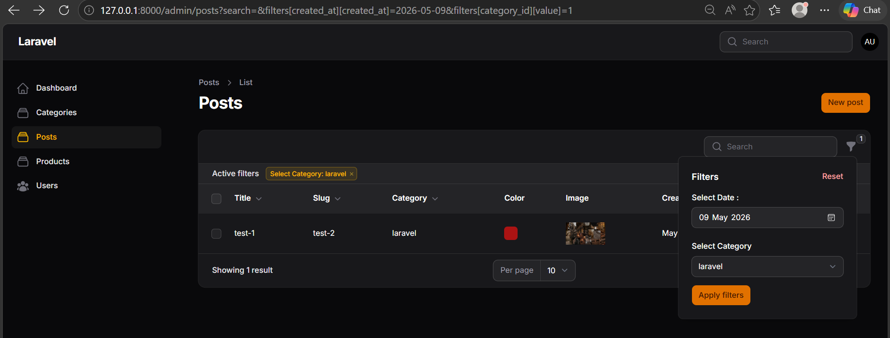
</blockquote>

 

<h3>Analisis & Diskusi</h3>

 
<blockquote>
 
**1. Mengapa search tidak cocok untuk filter tanggal?**  
Fitur search dirancang untuk mencari kecocokan pola teks, sehingga sangat efektif untuk kolom seperti title atau slug. Jika digunakan untuk tanggal, pengguna harus menebak secara pasti format tanggal dan waktu yang tersimpan di dalam database (misalnya harus mengetik "2026-02-28 14:36:12"). Ini sangat tidak user-friendly. Oleh karena itu menggunakan Filter (DatePicker) agar pengguna bisa memilih tanggal dari kalender visual, dan sistem akan mencari berdasarkan rentang hari tersebut tanpa mempedulikan jam, menit, atau detiknya.    
**2. Apa fungsi relationship() pada SelectFilter?**  
Fungsi relationship() digunakan untuk menghubungkan dropdown filter secara otomatis dengan tabel relasi yang ada di database. Daripada menuliskan pilihan kategori secara manual, method ->relationship('category', 'name') akan memerintahkan Filament untuk mengambil semua data dari tabel kategori, lalu menjadikan kolom name sebagai label teks yang muncul di layar, dan menggunakan ID kategori tersebut sebagai nilai untuk menyaring data Post .   
**3. Mengapa kita perlu whereDate() pada query filter?** 
Di dalam database, kolom created_at memiliki tipe data Timestamp atau Datetime. Jika hanya menggunakan query biasa where('created_at', $date), Laravel akan mencari data yang waktunya tepat 00:00:00. Akibatnya, data tidak akan ditemukan. Dengan menggunakan whereDate(), Laravel akan mengabaikan bagian waktu (jam/menit/detik) di database dan hanya mencocokkan bagian tanggalnya saja (tahun, bulan, tanggal) sesuai dengan yang dipilih pengguna di kalender.   
**4. Apa perbedaan searchable() dan filters()?** 
-> searchable(): Digunakan untuk pencarian teks secara real-time menggunakan input teks bebas yang mana sangat cocok digunakan langsung pada kolom teks panjang seperti Title atau Slug.   
-> filters(): Digunakan untuk menerapkan kondisi spesifik atau kriteria tertentu menggunakan form input yang mana sangat cocok digunakan untuk menyaring data berdasarkan tanggal, kategori (relasi), atau status boolean (Aktif/Tidak Aktif). 
</blockquote>

