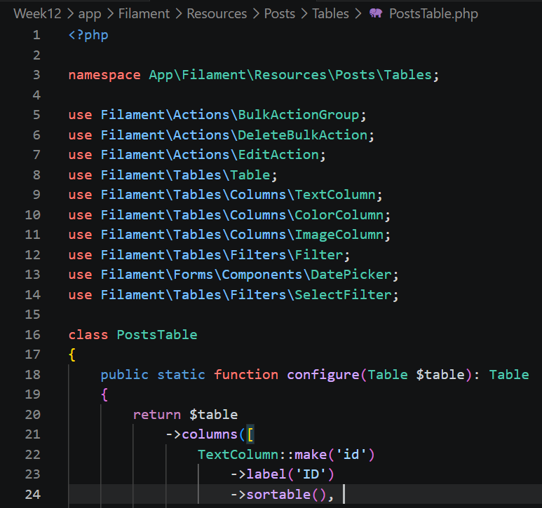
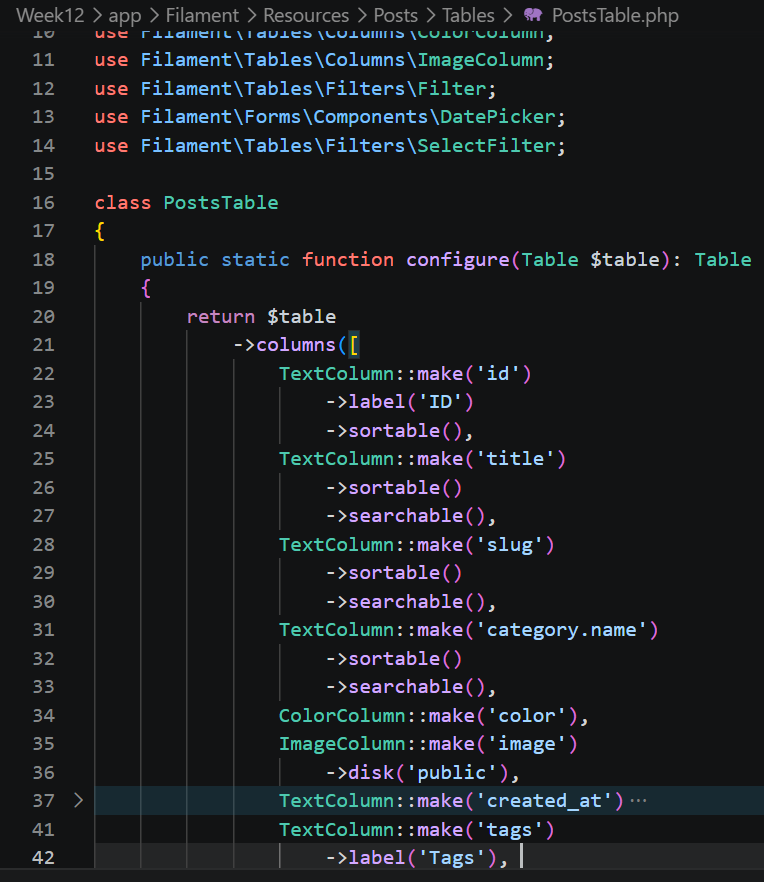
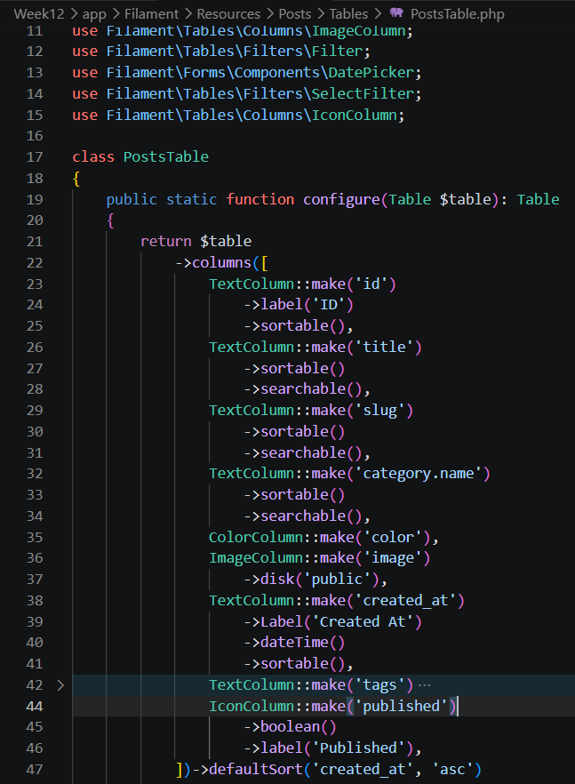
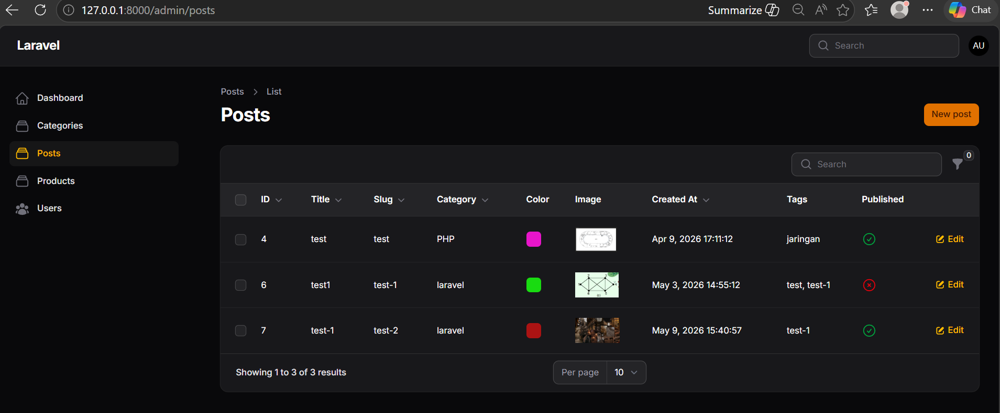
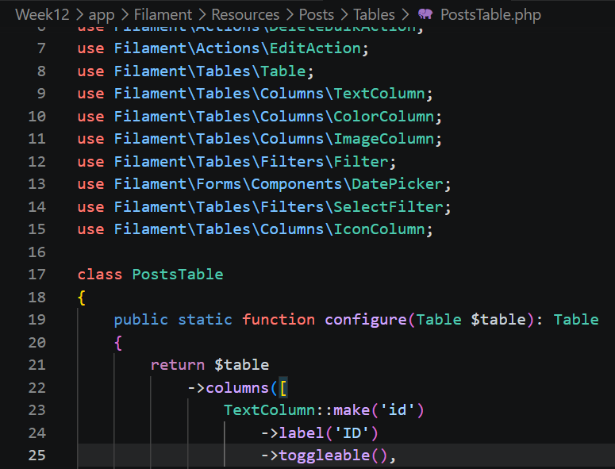
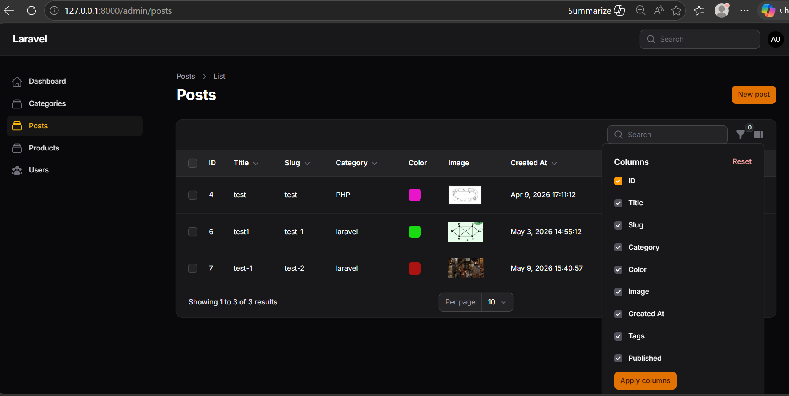
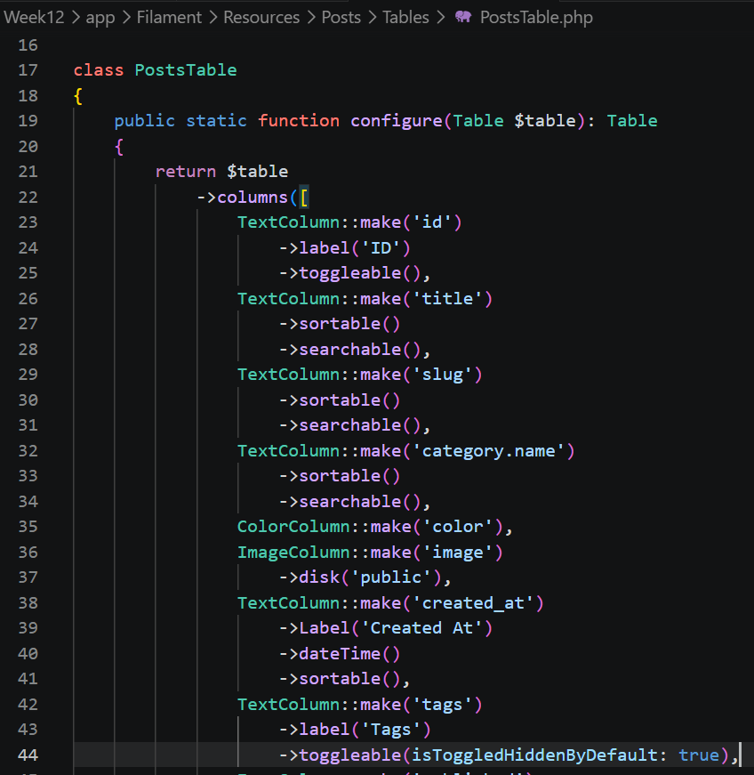
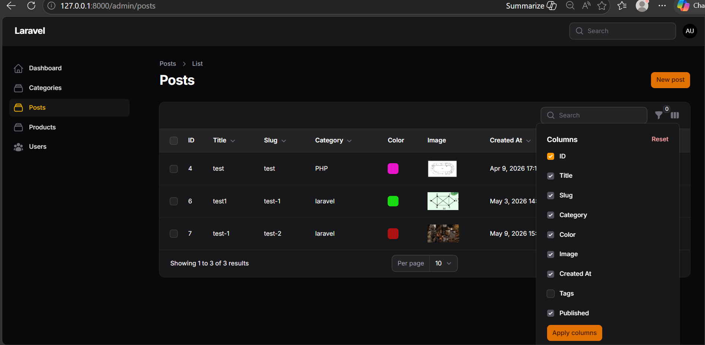
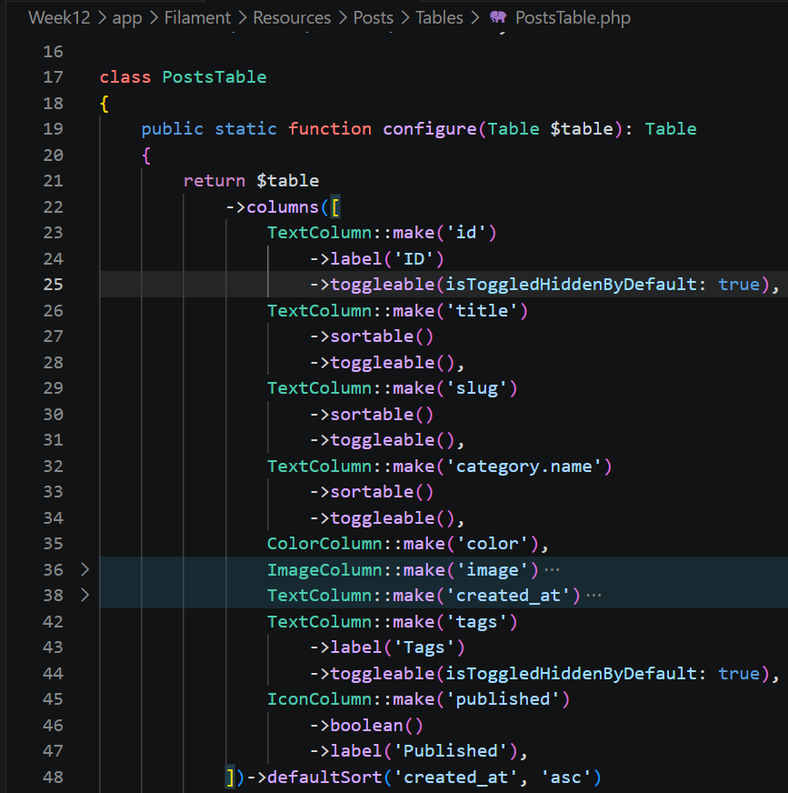
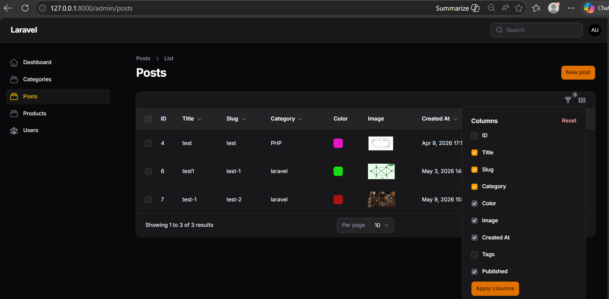

## NAMA  : NEVITA TRIYA YULIANA  
## KELAS : TI-2F  
## ABSEN : 20  

## LAPORAN PRAKTIKUM WEEK 12 – Implementasi Toggle Column pada Table Filament  
## LANGKAH - LANGKAH PRAKTIKUM:

<h3>A. Menambahkan Kolom Baru</h3>

 
<blockquote>

## 1. Menambahkan Kolom ID
**Code** 
 
## 2. Menambahkan Kolom Tags
**Code** 
  
## 3. Menambahkan Kolom Published (Boolean)
**Code**  
 
## Output

</blockquote>

 

<h3>B. Mengaktifkan Toggle Column</h3>

 
<blockquote>

## Code
 
## Output 

</blockquote>

 

<h3>C. Menyembunyikan Kolom Secara Default</h3>

 
<blockquote>

## Code
 
## Output

</blockquote>

 

<h3>D. Menerapkan Toggle pada Semua Kolom</h3>

 
<blockquote>

## Code
 
## Output

</blockquote>

 

<h3>Analisis & Diskusi</h3>

 
<blockquote>
 
**1. Mengapa toggle column penting pada admin panel?** 
Fitur toggle column sangat penting untuk menjaga antarmuka tabel tetap rapi dan tidak penuh, terutama pada sistem yang memiliki banyak data dan kolom dinamis. Jika semua kolom ditampilkan sekaligus, tabel akan terlihat sulit dibaca. Dengan fitur toggle column, tampilan tabel menjadi jauh lebih fleksibel karena user dapat mengatur sendiri kolom mana saja yang relevan.  
**2. Apa perbedaan toggleable() biasa dengan isToggledHiddenByDefault??**  
-> toggleable() biasa: Kolom tersebut bisa disembunyikan melalui menu dropdown, tetapi saat halaman web pertama kali dimuat, kolom ini dalam keadaan ditampilkan (tercentang).  
-> isToggledHiddenByDefault(): Kolom tersebut juga memiliki fitur toggle, tetapi saat halaman pertama kali dimuat, kolom ini dalam keadaan disembunyikan secara default (tidak tercentang). Pengguna harus membuka menu dropdown dan mencentangnya secara manual jika ingin melihatnya.  
**3. Mengapa preferensi kolom tetap tersimpan?**  
Karena secara internal, Filament otomatis menyimpan data preferensi kolom mana saja yang diaktifkan atau disembunyikan oleh pengguna ke dalam session browser. Berkat penyimpanan di session ini, konfigurasi tabel tidak akan reset atau berubah meskipun pengguna berpindah ke halaman lain lalu kembali lagi ke halaman tersebut.  
**4. Kapan sebaiknya kolom disembunyikan secara default?**  
Kolom sebaiknya disembunyikan secara default ketika data di dalamnya tidak terlalu sering dibaca secara langsung untuk kebutuhan harian, tetapi sesekali tetap dibutuhkan untuk analisis mendalam atau pencarian spesifik. 
</blockquote>

