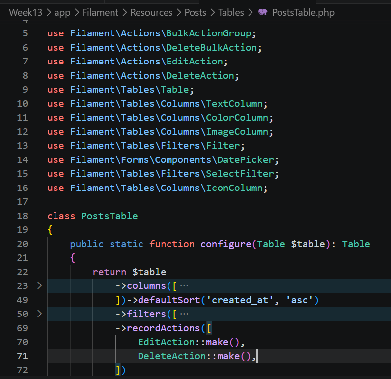
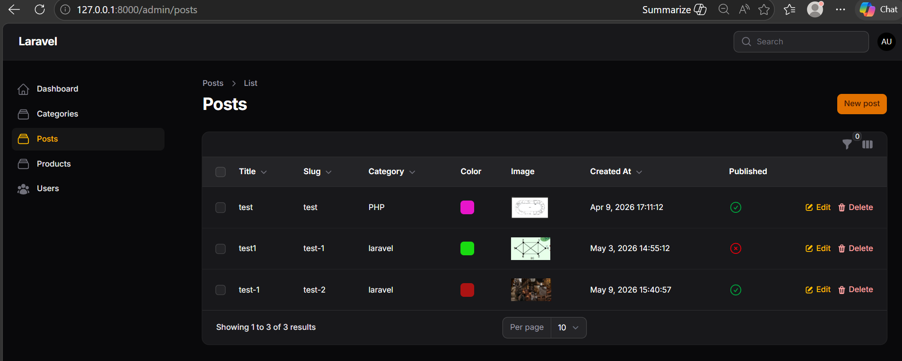
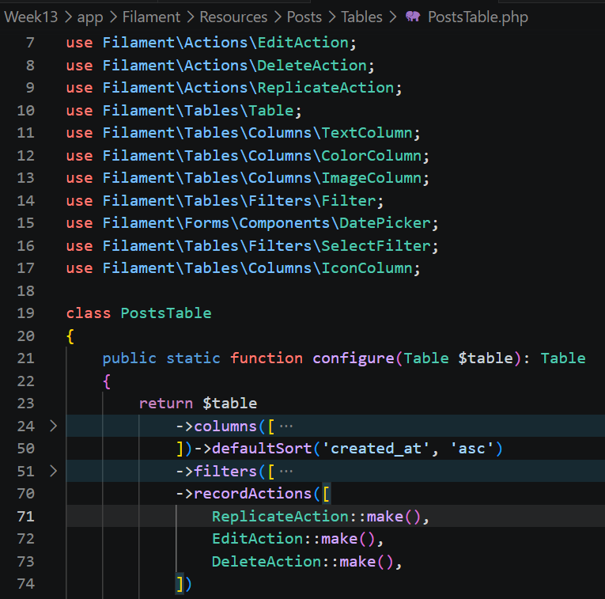
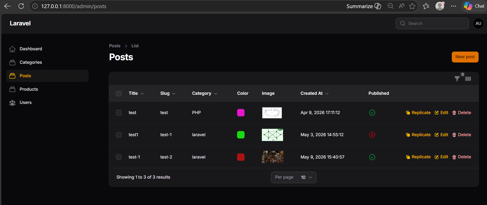
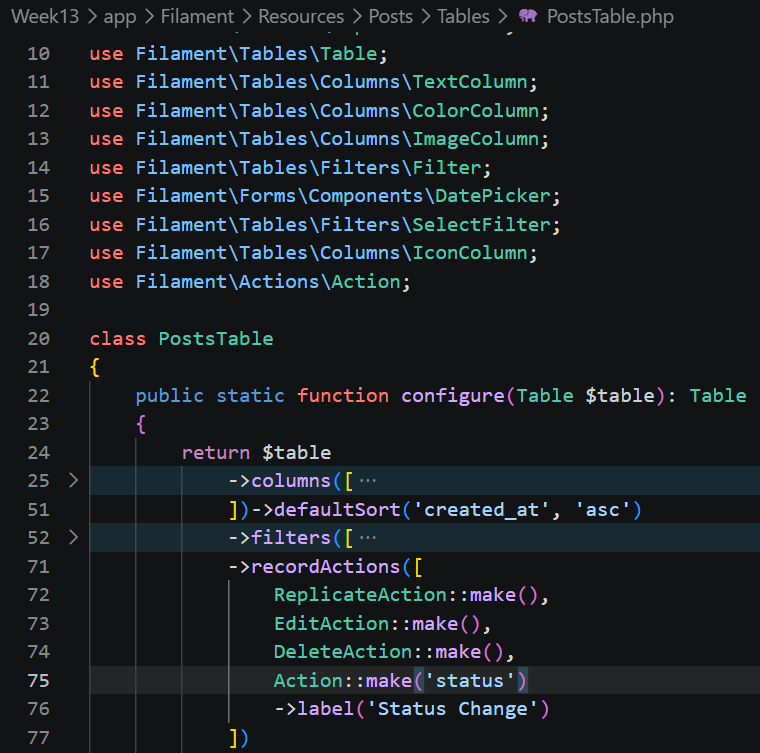
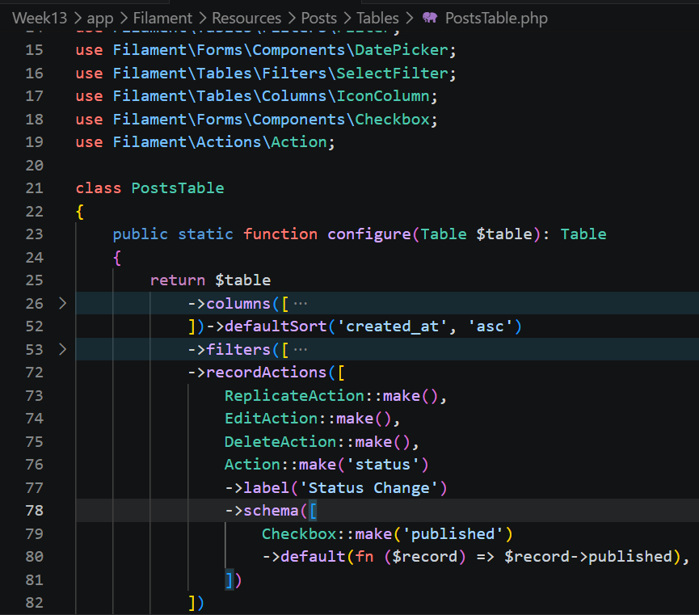
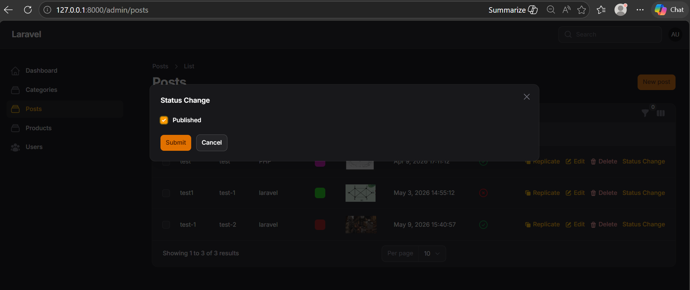
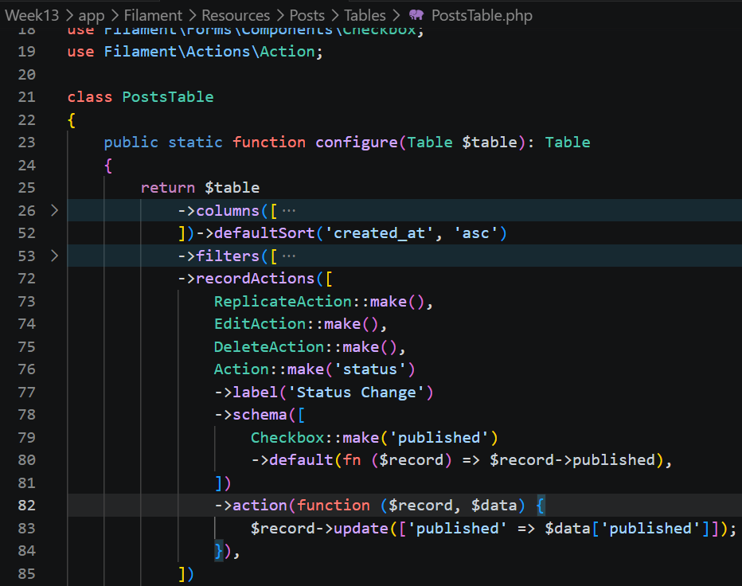
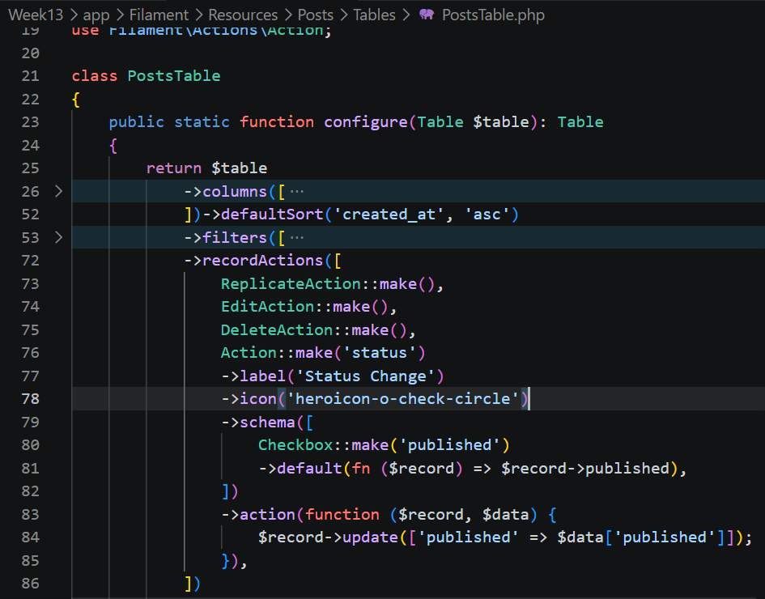
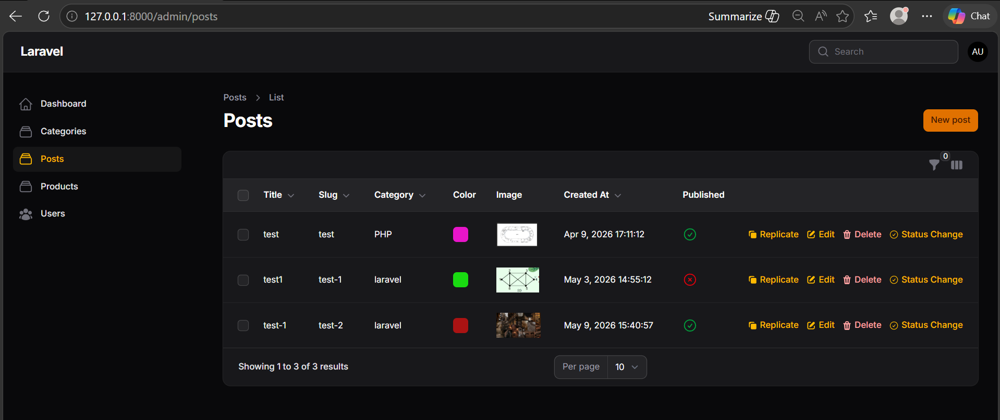

## NAMA  : NEVITA TRIYA YULIANA  
## KELAS : TI-2F  
## ABSEN : 20  

## LAPORAN PRAKTIKUM WEEK 13 – Implementasi Table Actions & Custom Action di Filament  
## LANGKAH - LANGKAH PRAKTIKUM:

<h3>A. Menambahkan Delete Action</h3>

 
<blockquote>

## Code
 
## Output

</blockquote>

 

<h3>B. Menambahkan Replicate (Copy) Action</h3>

 
<blockquote>

## Code
 
## Output

</blockquote>

 

<h3>C. Membuat Custom Action (Ubah Status Publish)</h3>

 
<blockquote>

## 1. Tambahkan Custom Action
**Code** 
 
## 2. Tambahkan Form Input pada Action
**Code** 
 
## Ouput

## 3. Tambahkan Logic untuk Update Data
**Code** 

## 4. Tambahkan Icon
**Code** 

## Output

</blockquote>

 

<h3>Analisis & Diskusi</h3>

 
<blockquote>
 
**1. Mengapa action di tabel lebih efisien dibanding halaman edit?**  
Action di dalam tabel sangat efisien karena pengguna dapat langsung mengeksekusi perintah (seperti menghapus, menduplikasi, atau mengubah status spesifik) dari List Page. Hal ini menghemat waktu karena pengguna tidak perlu lagi membuka halaman Edit secara terpisah yang memakan waktu loading hanya untuk melakukan perubahan kecil atau penghapusan data.    
**2. Apa perbedaan predefined action dan custom action?**  
-> Predefined action Adalah aksi bawaan dari Filament yang sudah disediakan dan siap pakai tanpa perlu menulis logika dari nol. Contohnya adalah Create, Edit, View, Delete, dan Replicate. Filament secara otomatis tahu apa yang harus dilakukan ketika tombol-tombol tsb diklik.   
-> Custom action Adalah aksi yang dibuat dan definisikan sendiri perilakunya menggunakan Action::make(). Pada custom action, bebas menentukan sendiri form input apa yang akan muncul melalui ->schema() dan logika penyimpanan apa yang akan dijalankan melalui fungsi ->action().   
**3. Bagaimana cara menambahkan validasi dalam custom action?**  
Cara menambahkan validasi di dalam custom action adalah dengan menyematkannya langsung pada komponen form yang ada di dalam method ->schema(). Karena form di dalam action menggunakan komponen Filament Form yang sama, bisa menambahkan method validasi standar bawaan Laravel/Filament (seperti ->required(), ->maxLength(), atau ->numeric()) persis di bawah definisi input field-nya, misalnya di bawah komponen Checkbox atau TextInput yang kamu buat di dalam action tersebut.    
**4. Kapan kita menggunakan Replicate?**  
Tombol Replicate/duplikasi digunakan ketika ingin menambahkan baris data baru yang nilainya persis atau mayoritas sama dengan data yang sudah ada di database. Daripada menginput data dari form kosong dan mengisi ulang semua kolom secara manual, pengguna cukup menekan tombol Replicate untuk menyalin data lama, lalu sedikit menyesuaikan bagian yang berbeda. Hal ini mempercepat proses data entry secara signifikan.  
</blockquote>

