## NAMA  : NEVITA TRIYA YULIANA  
## KELAS : TI-2F  
## ABSEN : 19  

## LAPORAN PRAKTIKUM WEEK 14 – Implementasi Relation pada Filament (HasMany)  
## LANGKAH - LANGKAH PRAKTIKUM:

<h3>A. Membuat Dropdown Searchable</h3>

 
<blockquote>

## Code
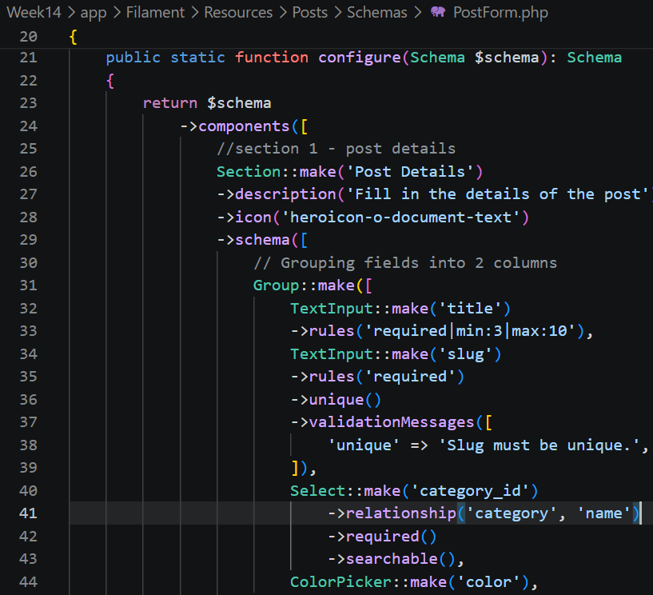 
## Output
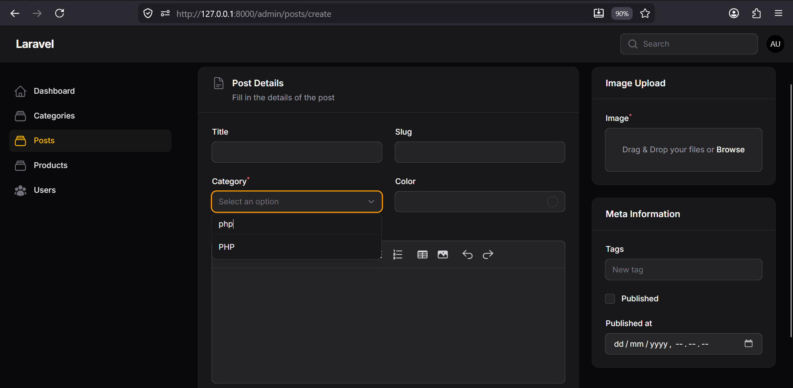
</blockquote>

 

<h3>B. Relationship pada Model</h3>

 
<blockquote>

## Code
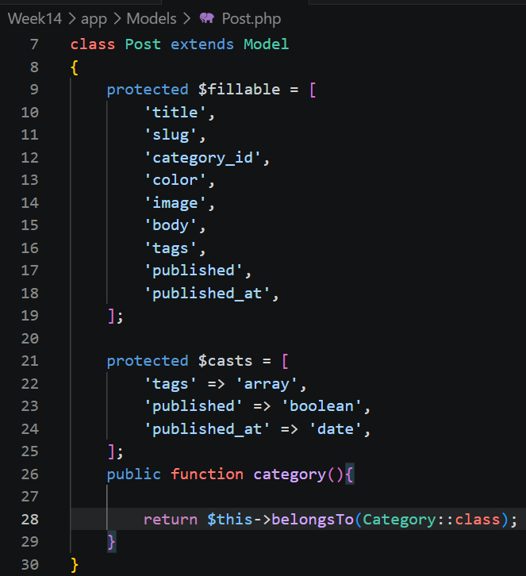 
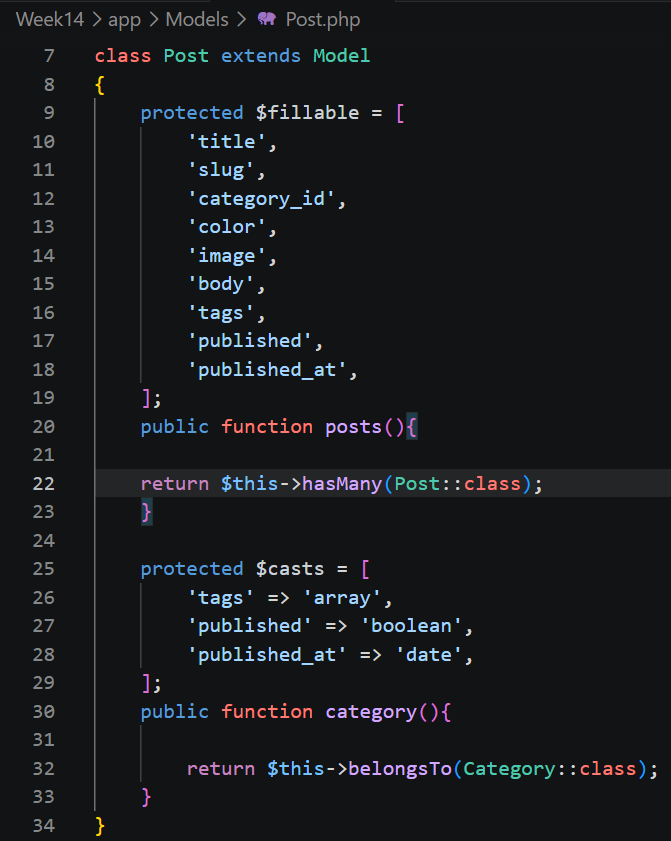 
</blockquote>

 

<h3>C. Menampilkan Data Relasi pada Table</h3>

 
<blockquote>

## Code
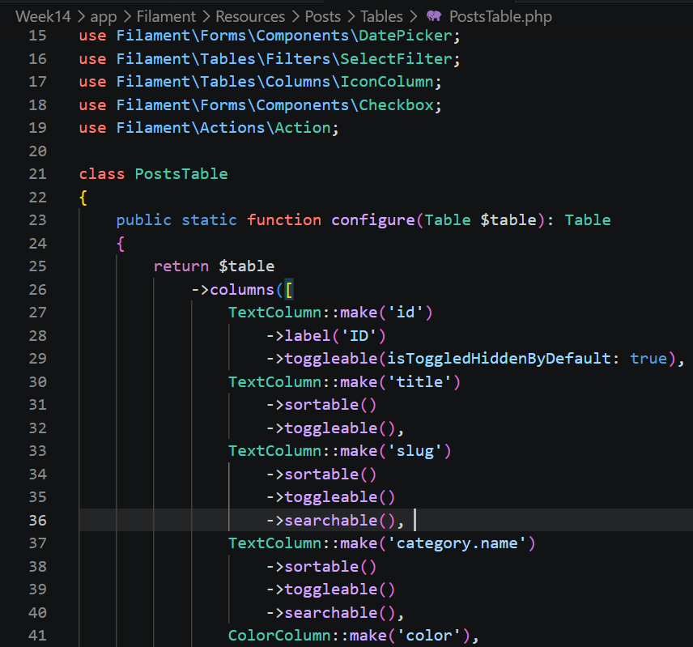
## Output
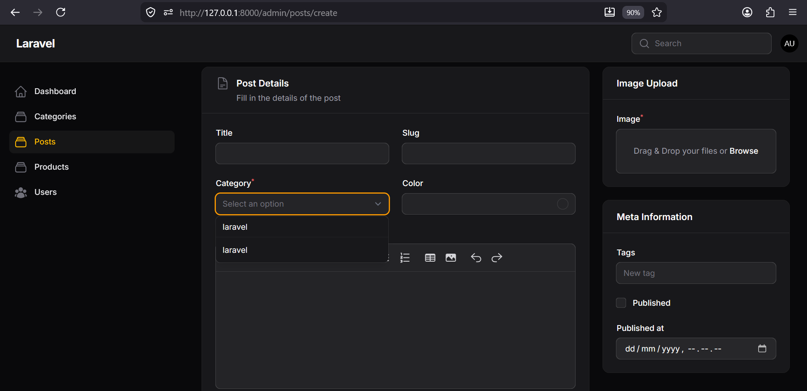
</blockquote>

 

<h3>D. Membuat Relationship Manager</h3>

 
<blockquote>

## Command
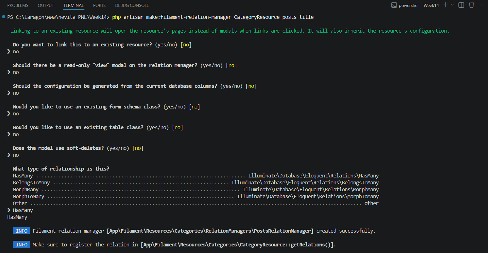 
## File yang dibuat
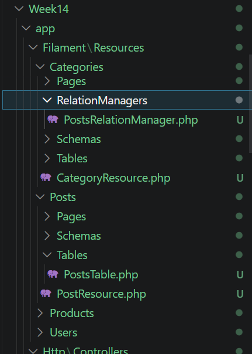 
</blockquote>

 

<h3>E. Menghubungkan Relationship Manager</h3>

 
<blockquote>

## Code
**CategoryResource.php**  
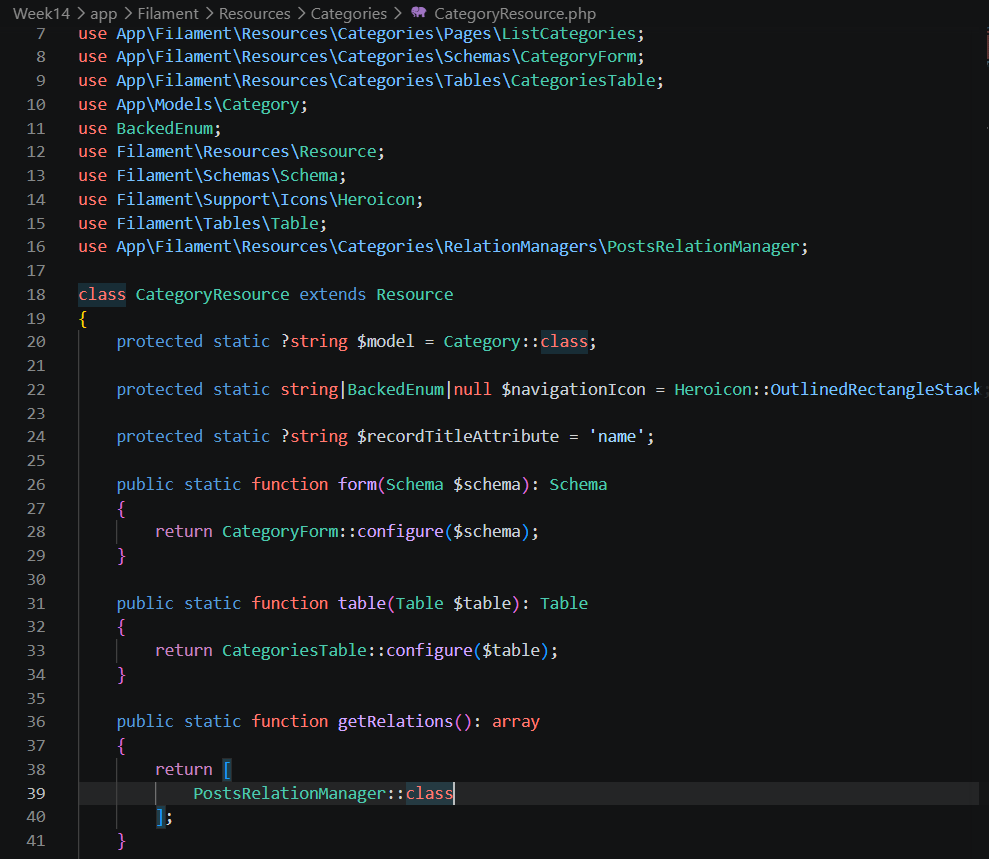 
**Category.php**  
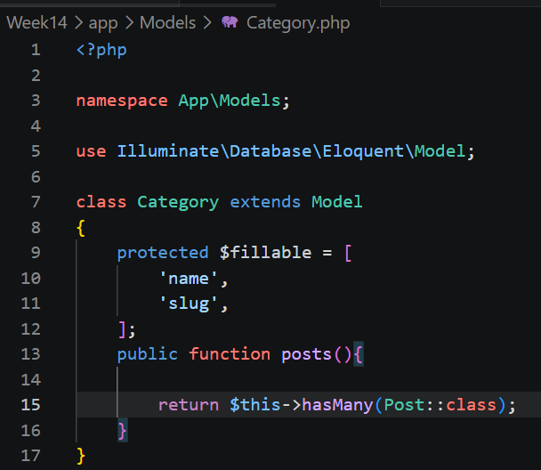 
## Output
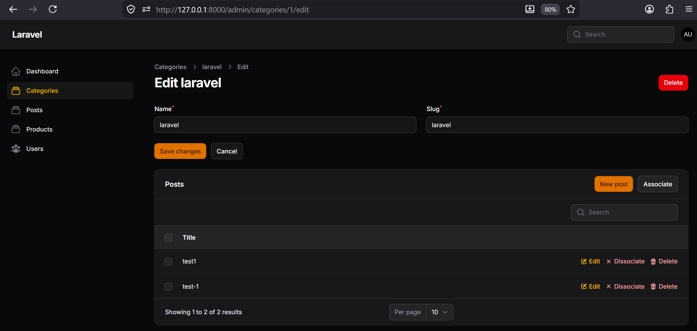 
</blockquote>

 

<h3>F. Menambahkan Kolom pada Relationship Table</h3>

 
<blockquote>

## Code
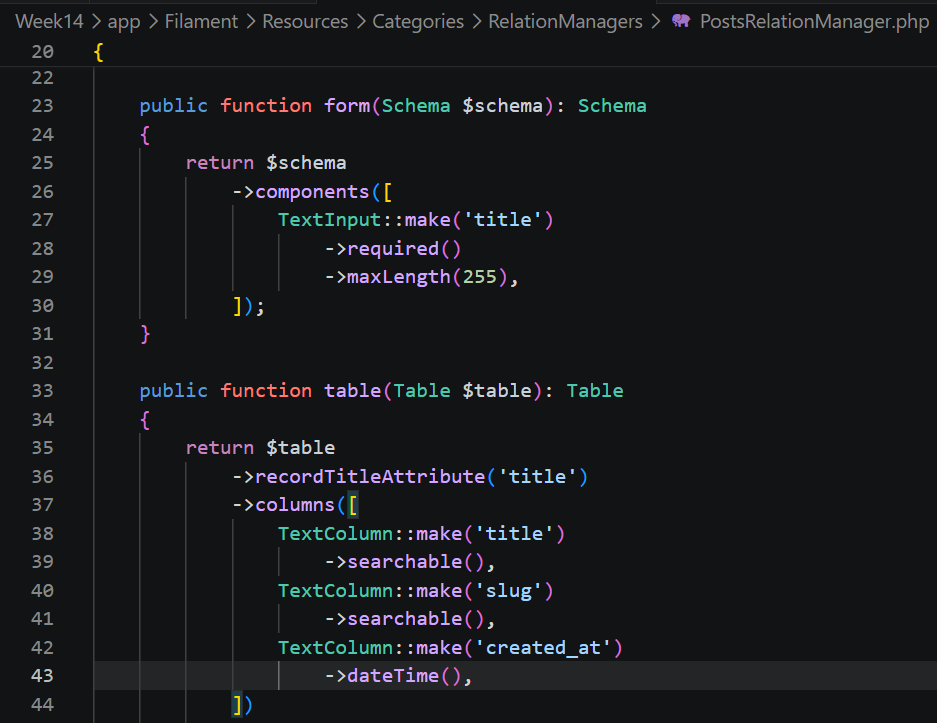 
## Output
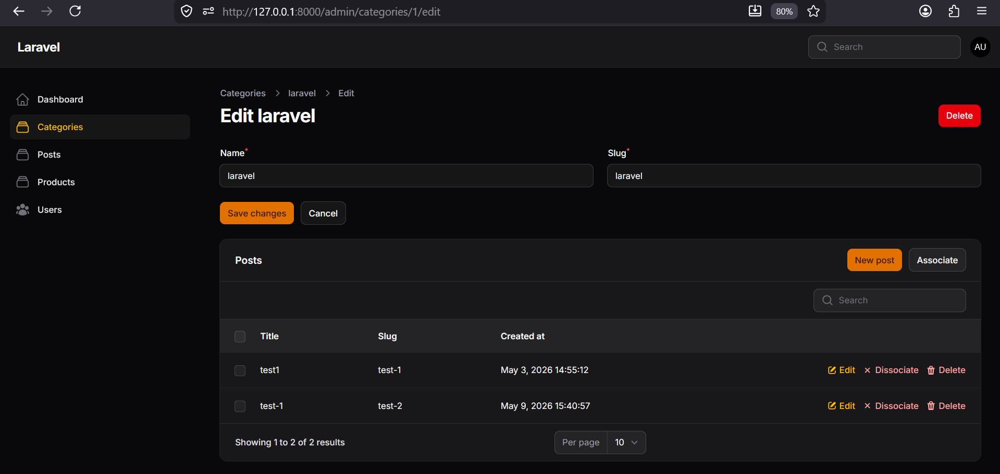 
</blockquote>

 

<h3>G. Membuat Form Create Post pada Relationship</h3>

 
<blockquote>

## Code
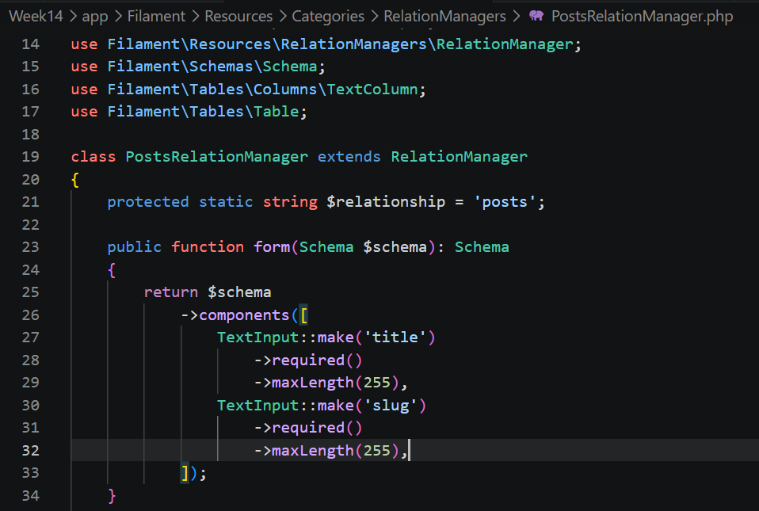 
## Output
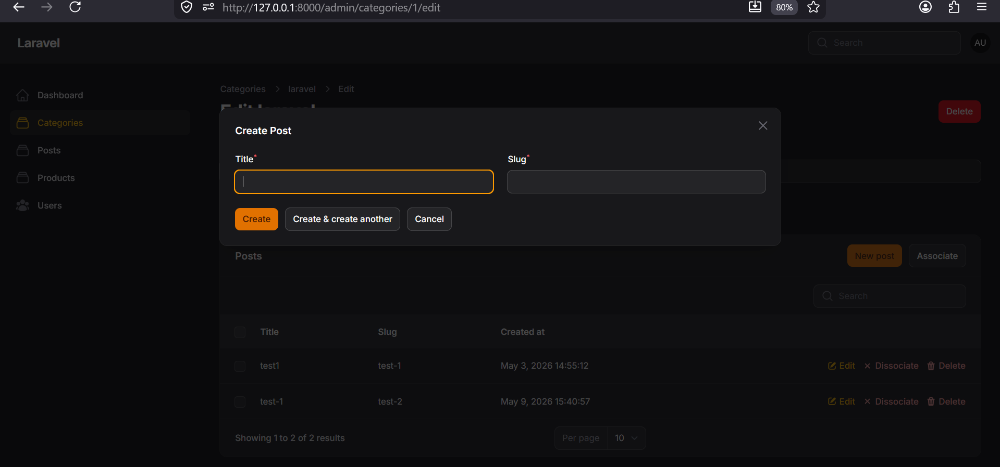 
</blockquote>

 

<h3>Analisis & Diskusi</h3>

 
<blockquote>
 
**1. Apa perbedaan relationship() dengan options()?** 
-> options(): Mengambil data secara manual dan memuat seluruh datanya sekaligus ke dalam memori aplikasi (contohnya menggunakan Category::all()->pluck('name', 'id')). Options kurang efisien jika datanya sangat banyak. 
-> relationship(): Mengotomatiskan proses pengambilan data menggunakan relasi Eloquent yang sudah didefinisikan di Model. Relationship lebih efisien, dan otomatis terintegrasi dengan fitur Filament lainnya (seperti pencarian) tanpa perlu menulis query manual.    
**2. Mengapa searchable penting untuk dataset besar?**  
Jika sebuah sistem memiliki ribuan data kategori, memuat semua data sekaligus ke dalam dropdown akan membuat halaman web menjadi sangat lambat atau bahkan crash. Fitur searchable sangat penting karena tidak perlu memuat semua data sekaligus, hanya akan mencari dan memuat data secara spesifik sesuai dengan kata kunci yang diketik oleh pengguna, sehingga jauh lebih cepat untuk dataset besar.    
**3. Apa fungsi Relationship Manager pada Filament?** 
Relationship Manager berfungsi untuk mengelola data relasi secara langsung dari halaman resource utama tanpa perlu berpindah-pindah halaman. Contohnya, bisa melihat, membuat (Create), mengedit (Update), atau menghapus (Delete) baris data Post langsung dari dalam halaman edit Category. Selain itu, juga otomatis mengisikan foreign key (seperti category_id) saat membuat data baru, sehingga mengurangi risiko kesalahan input.  
**4. Kapan menggunakan HasMany dan BelongsTo?**  
Kedua metode ini digunakan untuk mendefinisikan relasi "Satu-ke-Banyak" (One-to-Many), tetapi diletakkan di sisi yang berbeda: 
-> HasMany (Memiliki Banyak): Digunakan pada tabel/model "Induk" (Parent) yang bisa memiliki banyak data turunan. Contoh: Satu Kategori memiliki banyak Post (Category → HasMany → Post). 
-> BelongsTo (Milik / Bagian Dari): Digunakan pada tabel/model "Anak" (Child) yang menyimpan foreign key (ID Induk) dan hanya terikat pada satu data induk. Contoh: Satu Post hanya memiliki satu Kategori (Post → Belongs To → Category). 
</blockquote>

