## NAMA  : NEVITA TRIYA YULIANA  
## KELAS : TI-2F  
## ABSEN : 19  

## LAPORAN PRAKTIKUM WEEK 16 – RESTful API 
## LANGKAH - LANGKAH PRAKTIKUM:

<h3>Praktikum 1: Membuat autentikasi token pada RESTful API</h3>

 
<blockquote>

## 1. Buatlah proyek baru Laravel 
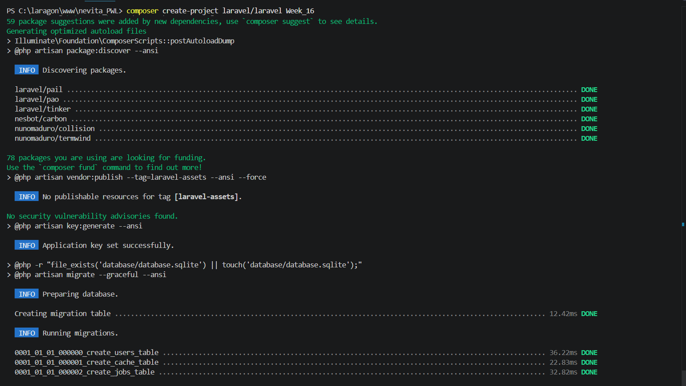
## 2. Tambahkan package laravel sanctum 
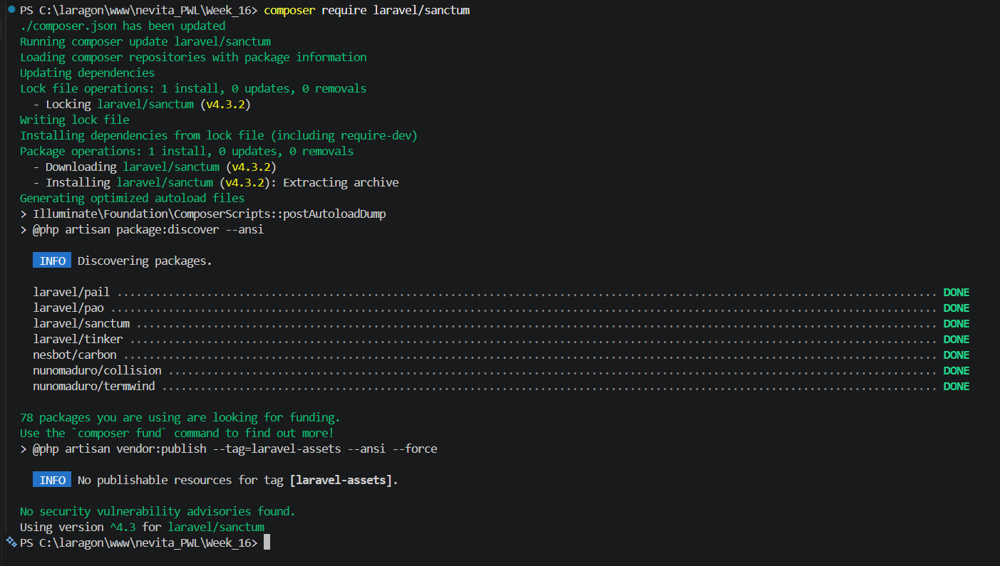
## 3. Publish konfigurasi dari Laravel sanctum
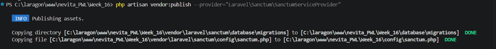
## 4. Sisipkan trait HasApiTokens ke dalam file User.php
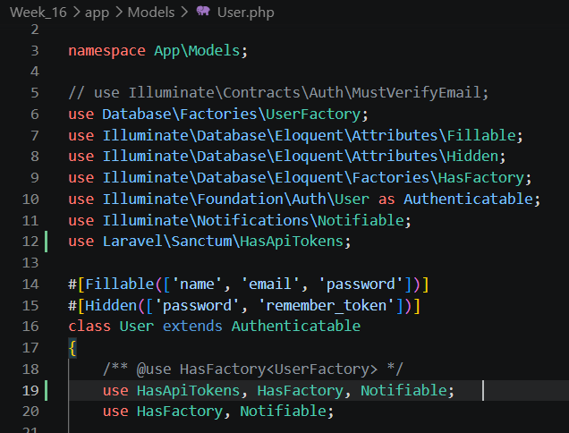
## 5. Buatlah database kosong dan atur koneksi ke database baru dengan menyesuaikan file .env
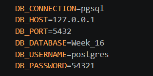
## 6. Jalankan migrate data 
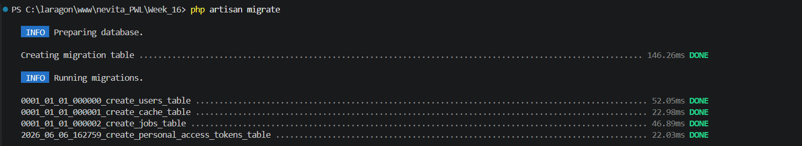
## 7. Pastikan proyek bisa dijalankan dan tidak ada kesalahan
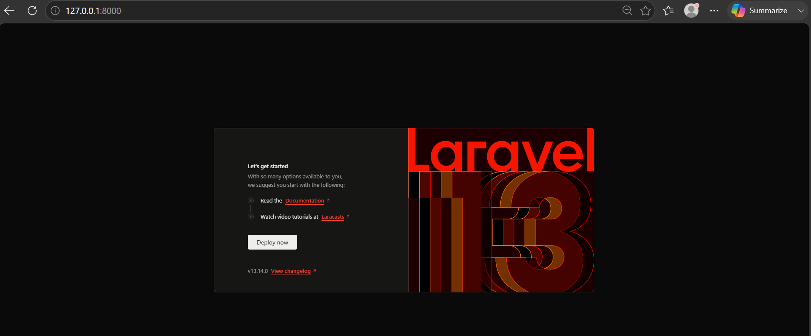
## 8. Tambahkan trait ApiResponse.php di lokasi directory app/Traits/ApiResponse.php
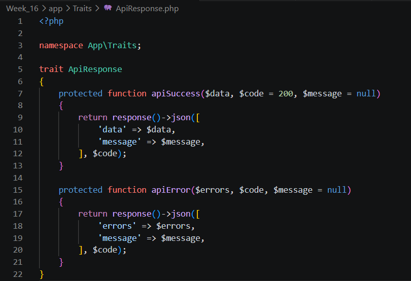
## 9. Buatlah custom request untuk menangani request spesifik terhadap API
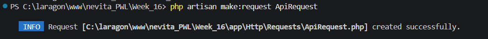
## 10. Class ApiRequest diganti menjadi abstract class ApiRequest
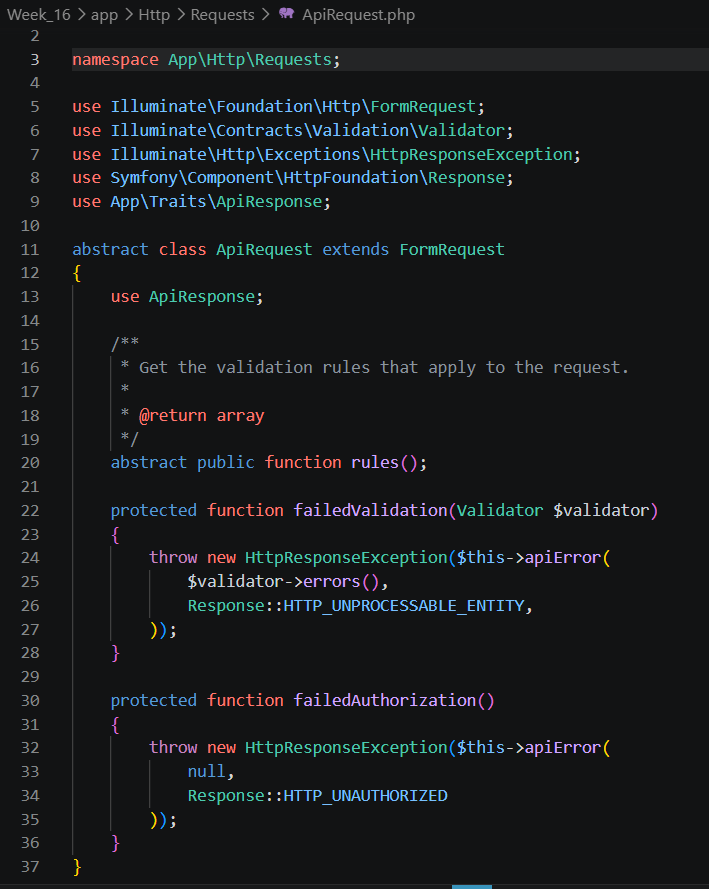
## 11. Buatlah controller untuk menangani autentikasi
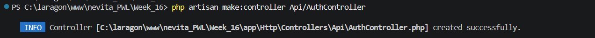
## 12. Tambahkan Trait ApiResponse
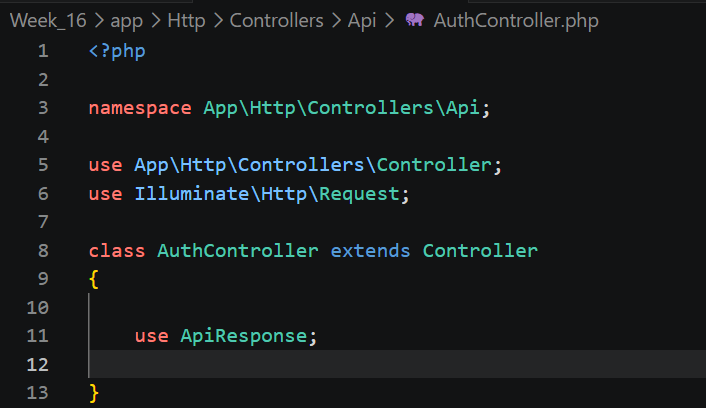
## 13. Buatlah custom request dengan nama RegisterRequest
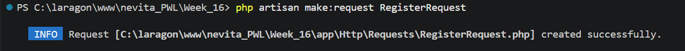
## 14. Ubah parent class yng ada di file RegisterRequest.php menjadi ApiRequest
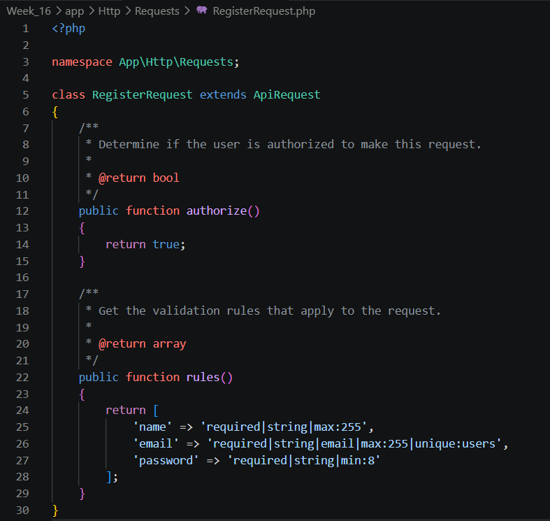
## 15. Tambahkan function register dengan parameter RegisterRequest pada Api/AuthController
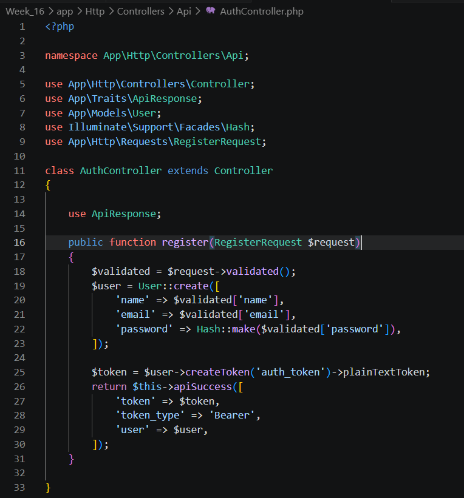
## 16. Buatlah custom request dengan nama LoginRequest, lalu modifikasi isi dari LoginRequest.php
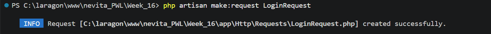 
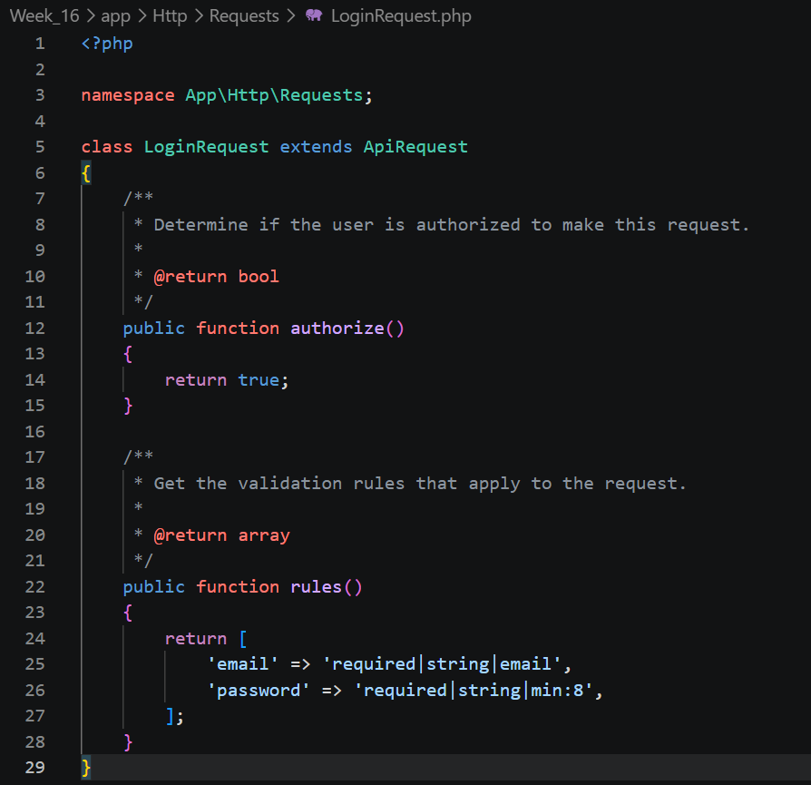
## 17. Letakkan function login pada file Api/AuthController.php
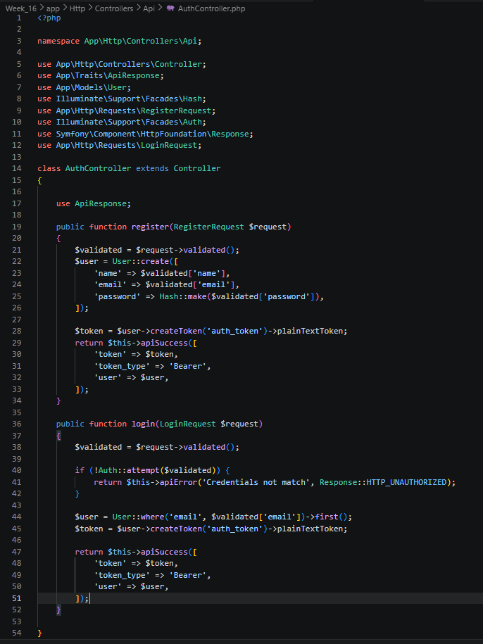
## 18. Tambahkan route baru untuk register dan juga login pada file routes/api.php
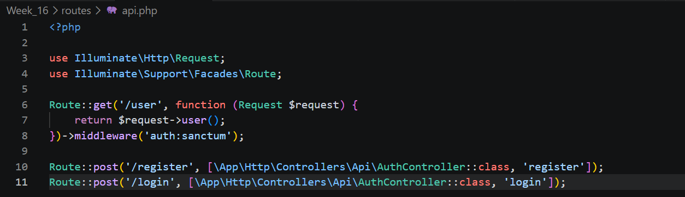
## 19. Ubah semua path {{baseurl}} menjadi path server development
**Register** 
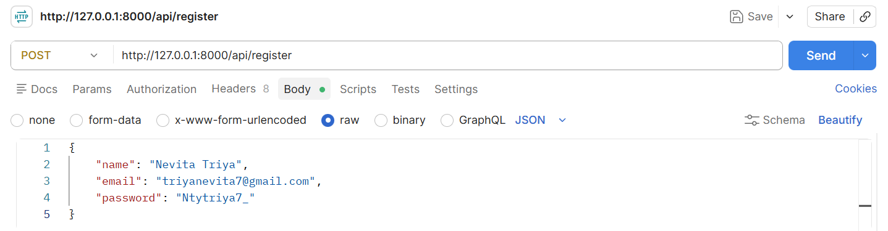 
**Login** 
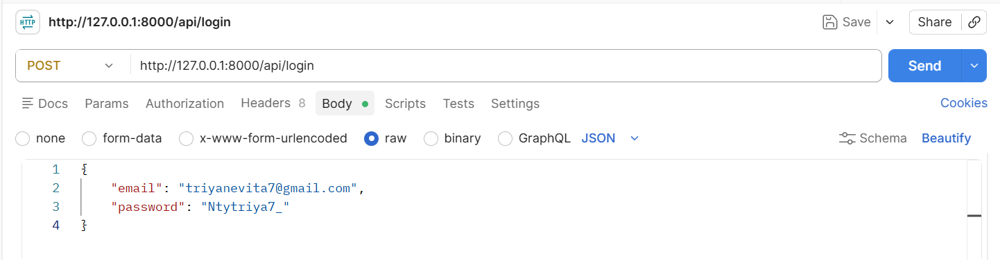
## 20. Copy token yang didapatkan dari proses login atau register pada postman
**Register** 
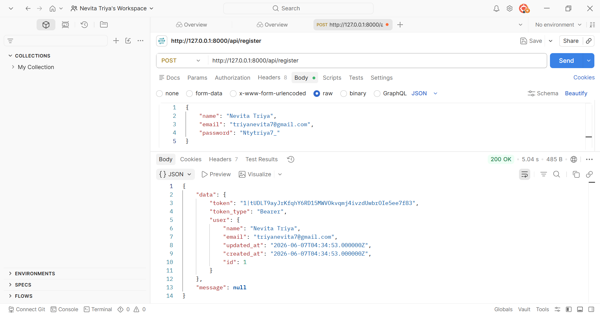 
 
**Login**  
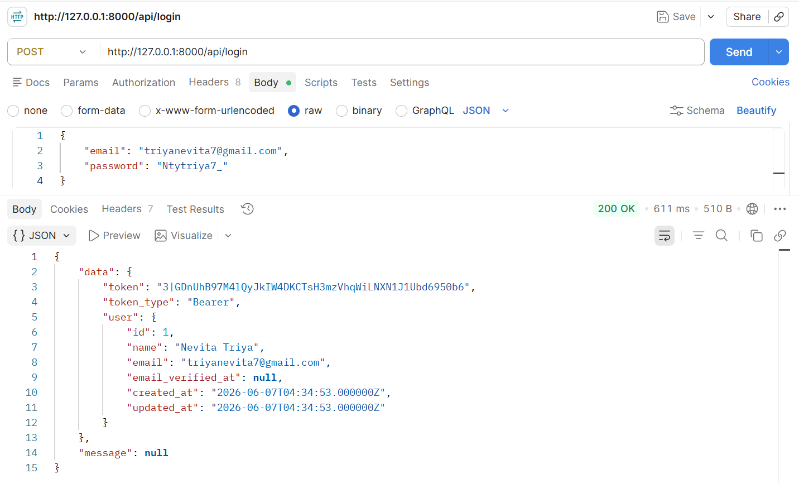 
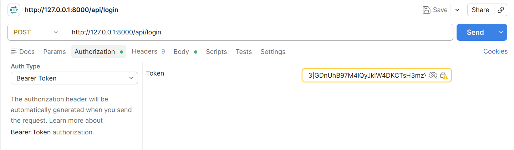 
## 21. Tambahkan fungsi untuk menghapus token sebagai implementasi fitur logout pada file Api/AuthController.php
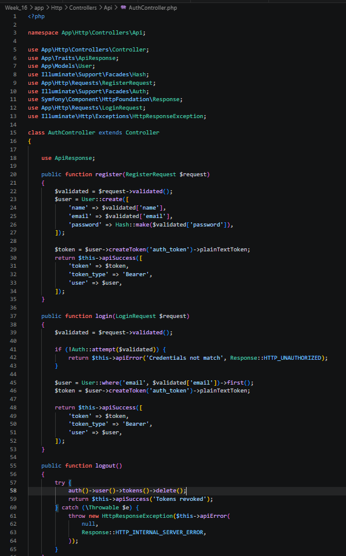
## 22. Tambahkan route pada routes/api.php untuk endpoint logout
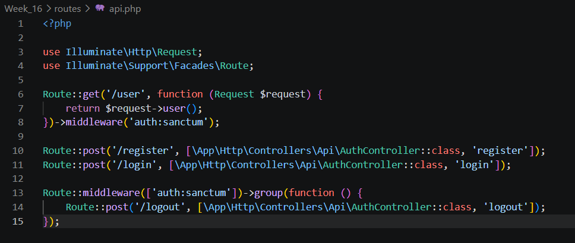
## 23. Buka postman, lakukan percobaan request logout dengan menyisipkan informasi token pada tab Authorization di postman
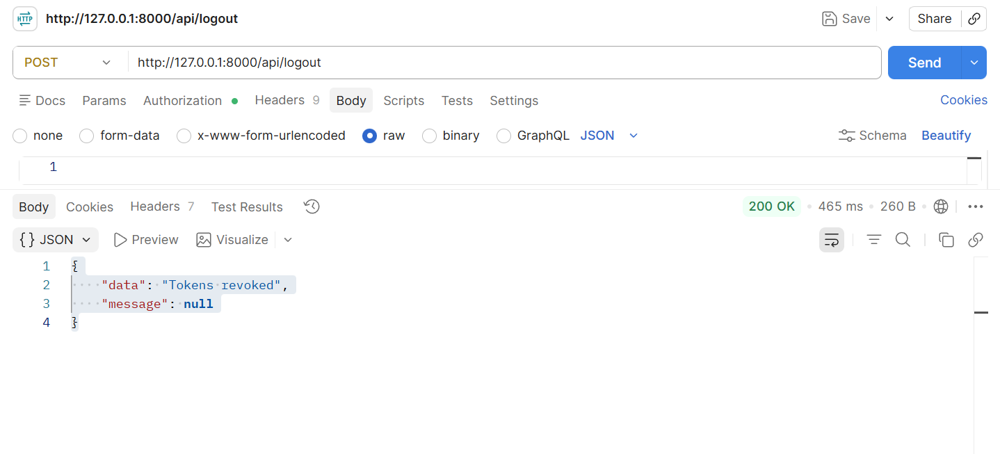
</blockquote>

 

